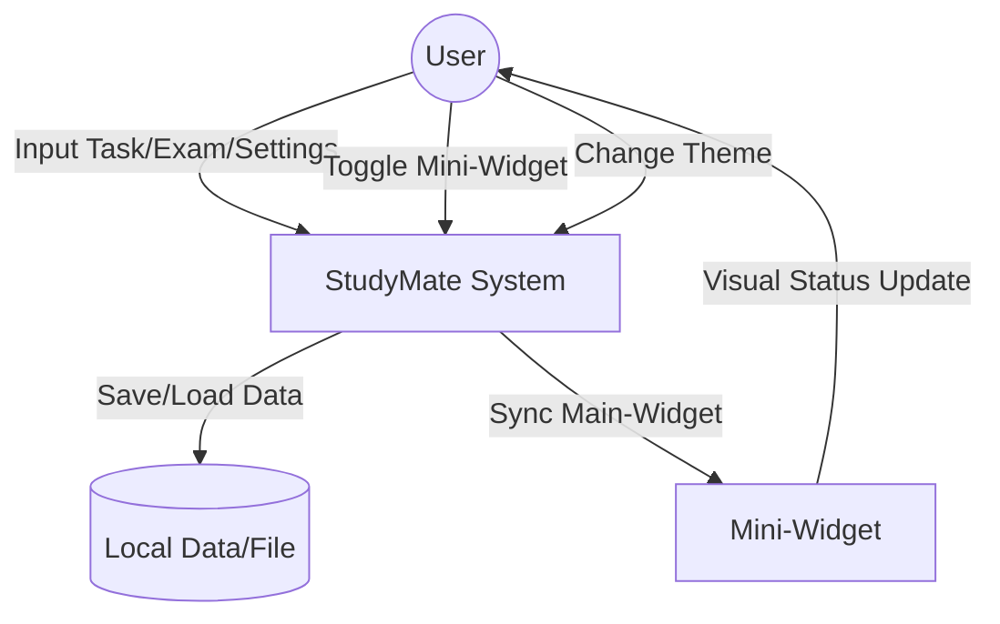

# [Conceptualization] StudyMate

**StudyMate — 대학생 학습 효율 극대화를 위한 과제 및 시험 통합 관리 시스템**

---

## 1. Business purpose

### 1.1. Project background
대학 생활은 끊임없는 학업의 연속이다. 학생들은 매 학기 수많은 과제(Assignment)와 시험(Exam)에 직면하며, 각 항목은 저마다의 마감 기한, 세부 수행 단계, 시험 범위, 그리고 준비 상태를 가지고 있다. 단순히 "무엇을 해야 한다"는 사실을 아는 것보다 중요한 것은, **"현재 어느 정도 진행되었는가(Progress)"**와 **"시험을 위해 무엇이 남았는가(Checklist)"**를 정확히 파악하는 것이다.

기존의 일반적인 To-Do 리스트 앱들은 이러한 학업 특화적 요구사항을 충족시키지 못한다. 과제의 경우 단순히 '완료/미완료'로만 나뉘어 세부적인 진행 과정을 추적하기 어렵고, 시험의 경우 단순한 날짜 기록 외에 '회독 수'나 '시험 범위'와 같은 학습 맥락을 담아내지 못한다. 이러한 정보의 파편화는 학생들로 하여금 마감 직전의 급박한 상황을 초래하거나, 시험 준비 과정에서 불필요한 불안감을 느끼게 만드는 원인이 된다.

'StudyMate'는 이러한 문제점을 해결하기 위해 탄생했다. 본 소프트웨어는 과제의 세부 할 일(Task)을 기반으로 한 **실시간 진행도 시각화**와, 시험 준비의 단계별 체크리스트를 통한 **체계적 학습 관리**를 핵심 가치로 삼는다. 또한, 학습 흐름을 방해하지 않으면서도 핵심 정보를 상시 확인할 수 있는 **미니 위젯(Mini-Widget)** 기능을 제공하여, 사용자가 별도의 조작 없이도 자신의 학습 페이스를 유지할 수 있도록 돕는다. 즉, StudyMate는 단순한 기록 도구가 아니라 학생의 학습 사이클을 함께 관리하는 스마트한 파트너를 지향한다.

### 1.2. Goal
- **학습 데이터의 입체적 관리:** 과제의 진행률(%)과 시험의 준비 단계(회독 등)를 데이터화하여 정량적인 학습 상태 파악을 가능하게 한다.
- **시각적 인지 극대화:** 프로그레스 바, D-Day 배지, 테마별 컬러 코딩을 통해 사용자가 직관적으로 마감 임박 사항을 인지하도록 한다.
- **학습 연속성 보장:** 미니 위젯을 통해 메인 작업 중에도 학습 현황을 상시 모니터링할 수 있는 환경을 구축한다.
- **심미적/기능적 사용자 경험 제공:** 테마 커스텀 및 SVG 아이콘 기반의 현대적인 UI를 통해 학습 동기를 부여하는 쾌적한 환경을 제공한다.

---

## 2. System context diagram

**[Term Description]**
- **User:** 과제 및 시험 정보를 등록하고, 학습 상태를 관리하며 시스템 설정을 변경하는 주체.
- **StudyMate System:** 데이터 처리, 진행도 계산, D-Day 산출, 테마 적용 및 메인-위젯 간 동기화를 담당하는 핵심 소프트웨어.
- **Local Data/File:** 사용자의 과제, 시험, 설정, 테마 정보가 영구적으로 저장되는 로컬 저장소.
- **Mini-Widget:** 메인 창과 별개로 작동하며, 최상단에 고정되어 실시간 학습 요약 정보를 제공하는 보조 UI 구성 요소.

---

## 3. Use case list

-  **Manage Assignment**
  - Actor : User
  - Description : 과제 이름, 과목, 마감일 및 세부 할 일을 등록하고, 각 할 일의 완료 여부에 따라 진행률을 업데이트한다.

-  **Manage Exam**
  - Actor : User
  - Description : 시험 과목, 날짜, 장소, 범위를 등록하고, 고정 회독 수 및 사용자 정의 체크리스트를 통해 시험 준비를 관리한다.

-  **Monitor via Mini-Widget**
  - Actor : User
  - Description : 메인 창을 열지 않고도 화면 상단에 고정된 미니 위젯을 통해 과제 진행도와 시험 D-Day를 상시 확인한다.

-  **Customize Theme**
  - Actor : User
  - Description : 시스템의 전체적인 색상 테마를 변경하여 개인의 학습 환경에 맞는 UI를 설정한다.

-  **Manage Trash**
  - Actor : User
  - Description : 삭제된 과제나 시험 항목을 휴지통에서 확인하고, 영구 삭제하거나 복구할 수 있다.

---

## 4. Concept of operation

-  **Assignment Progress Tracking**
  - Purpose : 과제의 세부 단계 관리 및 진행도 시각화
  - Approach : 사용자가 과제를 등록할 때 세부 할 일(Task) 목록을 생성한다. 각 Task의 체크박스를 클릭할 때마다 시스템은 `(완료된 Task 수 / 전체 Task 수) * 100` 공식을 사용하여 진행률을 재계산하고 프로그레스 바를 갱신한다.
  - Dynamics : 과제 내 할 일의 상태가 변경되거나 새로운 할 일이 추가/삭제될 경우
  - Goals : 사용자가 과제의 잔여 분량을 정량적으로 인지하여 계획적인 학습을 유도한다.

-  **Exam Readiness Management**
  - Purpose : 시험 대비 항목의 체계적 관리 및 D-Day 안내
  - Approach : 시험 등록 시 '1회독, 2회독' 등의 고정 항목과 사용자가 직접 입력하는 '추가 항목'을 모두 제공한다. 또한, 현재 날짜와 시험 날짜를 비교하여 D-Day를 계산하고, 남은 기간에 따라 배지의 색상을 동적으로 변경한다.
  - Dynamics : 시험 정보가 등록되거나 학습 체크리스트 항목이 변경될 경우
  - Goals : 시험 준비의 누락을 방지하고 긴박함을 시각적으로 전달한다.

-  **Mini-Widget Synchronization**
  - Purpose : 학습 흐름을 깨지 않는 상시 모니터링 환경 제공
  - Approach : 메인 창의 데이터가 변경(저장)될 때마다 `data_changed` 시그널을 발생시켜 미니 위젯의 리스트를 즉시 갱신(Refresh)한다. 미니 위젯은 `WindowStaysOnTopHint` 플래그를 통해 항상 최상단에 위치한다.
  - Dynamics : 메인 창에서 데이터가 수정, 삭제, 추가되거나 테마가 변경될 경우
  - Goals : 다른 작업을 수행하는 중에도 마감 임박 정보를 놓치지 않게 한다.

---

## 5. Problem statement

### 5.1. Overview
StudyMate는 단순한 기록 도구를 넘어 학습의 '흐름'을 관리해야 하므로, 데이터의 무결성, UI의 반응성, 그리고 사용자 경험의 일관성이 매우 중요하다.

### 5.2. Technical & Operational Problems

**Problem #1: Data Integrity & Real-time Synchronization (데이터 무결성 및 동기화)**
메인 창(MainWindow)과 미니 위젯(MiniWidget)은 서로 다른 윈도우 객체로 관리된다. 만약 메인 창에서 과제를 삭제했는데 미니 위젯에는 여전히 남아있다면 사용자에게 심각한 혼란을 줄 수 있다.
- **Solution:** 모든 데이터 변경은 Local DB를 통해 중앙 집중식으로 관리되며, 변경 발생 시 연결된 모든 UI 구성 요소(Tabs, Mini-Widget)에 즉시 명령을 전달하는 관찰자 패턴(Observer Pattern)을 적용한다.

**Problem #2: Dynamic UI Theming & Color Accessibility (테마 동적 적용 및 색상 접근성)**
사용자가 테마를 변경할 때, 단순히 배경색만 바뀌는 것이 아니라 그 위에 올라가는 아이콘, 텍스트, 프로그레스 바의 색상도 함께 바뀌어야 한다. 특히 어두운 배경에서 밝은 아이콘이, 밝은 배경에서 어두운 아이콘이 보이도록 하는 정교한 계산이 필요하다.
- **Solution:** 테마 코드 내에 어둠/밝음을 감별하는 함수와, 이 함수에 따라 icon의 색상을 변경하는 함수를 구현한다. 배경색의 RGB 평균값을 계산하여 임계치(Threshold)를 기준으로 텍스트와 아이콘의 색상을 `white` 또는 `primary color`로 자동 결정하는 알고리즘을 적용한다.

**Problem #3: Complexity of Nested Data Structures (중첩 데이터 구조의 관리)**
과제는 'Task 리스트'를 가지고 있고, 시험은 '고정 체크리스트'와 '사용자 정의 체크리스트'를 동시에 가진다. 이러한 복잡한 중첩 구조를 JSON/Dict 형태로 저장하고 불러올 때, 특정 항목의 수정이 전체 데이터 구조를 깨뜨리지 않도록 주의해야 한다.
- **Solution:** 데이터 모델링 단계에서 각 항목에 고유 ID(UUID)를 부여하고, 리스트를 순회할 때 ID를 기준으로 특정 요소만 정확히 찾아 업데이트하는 방식을 채택하여 데이터 오염을 방지한다.

**Problem #4: Performance of Frequent UI Rebuilds (잦은 UI 재구성의 성능 문제)**
데이터가 변경될 때마다 전체 UI를 다시 그리는 방식은 매우 확실한 방법이지만, 데이터 양이 많아질 경우 성능 저하를 일으킬 수 있다.
- **Solution:** 전체 화면을 다시 그리는 대신, 변경이 발생한 특정 탭(Tab)이나 위젯 영역만을 선택적으로 갱신하는 구조를 설계하고, 불필요한 위젯 생성을 방지하기 위해 함수를 통해 메모리 누수 없이 기존 위젯을 효율적으로 제거한다.

---

## 6. Non-Functional Requirements (NFRs)
본 소프트웨어의 품질 보증 및 안정적인 학습 환경 제공을 위해 다음과 같은 비기능적 요구사항을 정의한다.
1) UI Responsiveness & Synchronization (UI 반응성 및 동기화)
- 메인 창(MainWindow)과 미니 위젯(Mini-Widget) 간의 데이터 변경 사항은 0.5초 이내에 상호 반영되어야 한다.
- 데이터 업데이트(추가, 삭제, 수정) 발생 시, 관련 UI 요소(Tab, Card, Mini-Widget)는 즉각적으로 재구성(Rebuild/Refresh)되어 사용자에게 최신 상태를 보여주어야 한다.
2) Visual Accessibility & Theming (시각적 접근성 및 테마)
- 테마 변경(Mono, Pastel 등) 시, 모든 UI 컴포넌트의 배경색, 텍스트색, 아이콘 색상이 즉시 업데이트되어야 한다.
- 특히, 배경색의 명도에 따라 아이콘 및 텍스트 색상을 결정하는 알고리즘을 적용하여, 어떤 테마에서도 **가독성**을 유지해야 한다.
3) Data Persistence & Integrity (데이터 지속성 및 무결성)
- 사용자의 모든 학습 데이터(과제, 시험, 설정, 테마)는 프로그램 종료 시 또는 변경 직후 로컬 파일에 안전하게 저장되어야 한다.
- 데이터 로드 시, 기존에 저장된 테마 설정 및 미니 위젯의 위치 정보를 복구하여 사용자 경험의 연속성을 보장해야 한다.
4) Resource Efficiency (리소스 효율성)
- UI 재구성 시, 기존에 생성된 위젯들이 메모리 누수를 일으키지 않도록 레이아웃 내의 모든 위젯을 안전하게 제거(deleteLater)한 후 새 위젯을 생성해야 한다.

