# [Design] StudyMate

**StudyMate — 대학생 학습 효율 극대화를 위한 과제 및 시험 통합 관리 시스템**

---

## 1. Introduction
지난 analysis 문서에서 usecase diagram을 통해 기본적인 흐름을 이해하고 코드를 구조화하였다.
이어, 본 보고서에서는 analysis 과정을 거친 후 구조화한 class diagram을 그리고 class diagram description을 구체적으로 작성하였다.
현재 토대가 되는 코드는 대부분 완성되었으며 일부 기능 구현과 디버깅 과정이 남아있기 때문에, 해당 지점을 해결한 뒤 모든 과정을 완료할 수 있을 것으로 판단된다.

---

## 2. Class diagram
본 프로젝트는 python을 사용하여 구현된, Model-View-Controller 패턴과 유사한 구조를 가진 데스크톱 애플리케이션이다.
 아래는 상세 기능(인자와 기능)이 포함된 Class diagram이다. 외부 라이브러리 등 불필요한 상세 상속 표현은 생략하였다.

```mermaid
classDiagram
    %% 스타일 및 테마 정의 (GitHub 호환 문법으로 수정)
    classDef default fill:#FFFFFF,stroke:#5C5C5C,stroke-width:1px;

    %% ========== Core Application ==========
    class MainWindow {
        -dict data
        -MiniWidget mini_win
        -dict _tab_btns
        -QStackedWidget _stack
        -AssignmentTab _atab
        -ExamTab _etab
        -TrashTab _ttab
        -ToggleSwitch _top_tg
        +__init__(data, mini_win)
        -_build() void
        -_upd_tabs(str active) void
        -_switch(str key) void
        -_toggle_top(bool checked) void
        -_apply_top(bool on) void
        -_open_settings() void
        -_on_theme_changed() void
        -_on_data_changed() void
        -_save() void
        +closeEvent(e) void
    }

    class MiniWidget {
        -dict data
        -callable on_save
        -bool _locked
        -QPoint _drag_pos
        -str _cur_tab
        -ChecklistPopup _popup
        -dict _cmap
        -int _elapsed
        -bool _running
        -QTimer _timer
        -QTimer _inact
        -QLabel _time_lbl
        -QPushButton _s_btn
        -QPushButton _p_btn
        -QPushButton _x_btn
        +__init__(data, on_save)
        -_build() void
        -_color(item) str
        -_upd_tab_style() void
        -_switch_tab(str key) void
        -_refresh_list() void
        -_asgn_row(asgn, cfg, color) QFrame
        -_exam_row(exam, cfg, color) QFrame
        -_show_popup(e, item_data, itype, color) void
        -_save_refresh() void
        -_toggle_lock() void
        +set_always_on_top(bool on) void
        -_toggle_widget_settings() void
        -_on_widget_cfg_changed(key, val) void
        -_tick() void
        -_start() void
        -_pause() void
        -_auto_pause() void
        -_stop() void
        +reset_inactivity() void
        +mousePressEvent(e) void
        +mouseMoveEvent(e) void
        +mouseReleaseEvent(e) void
    }

    class TrayIcon {
        -_main MainWindow
        -_mini MiniWidget
        +__init__(main_win, mini_win, app)
        -_show_main() void
        -_toggle_mini() void
        -_activated(reason) void
    }

    class ActivityFilter {
        +pyqtSignal activity
        +eventFilter(obj, event) bool
    }

    %% ========== Tab Widgets ==========
    class AssignmentTab {
        -dict data
        -callable on_save
        -dict _cmap
        -QVBoxLayout _vl
        +__init__(data, on_save)
        -_col(item) str
        -_build() void
        -_rebuild() void
        -_changed() void
        -_add() void
        -_delete(str aid) void
    }

    class ExamTab {
        -dict data
        -callable on_save
        -dict _cmap
        -QVBoxLayout _vl
        +__init__(data, on_save)
        -_col(item) str
        -_build() void
        -_rebuild() void
        -_changed() void
        -_add() void
        -_delete(str eid) void
    }

    class TrashTab {
        -dict data
        -callable on_save
        -QVBoxLayout _vl
        +__init__(data, on_save)
        -_build() void
        -_rebuild() void
        -_del_one(str iid) void
        -_clear_all() void
    }

    %% ========== Card Widgets ==========
    class AssignmentCard {
        +pyqtSignal deleted
        +pyqtSignal changed
        -dict data
        -str color
        -callable on_save
        -QFrame _bar
        -QVBoxLayout _cl
        -QWidget _tw
        -QVBoxLayout _tl
        -QWidget _sw
        -QHBoxLayout _sl
        -QProgressBar _pbar
        -QLabel _pct
        +__init__(data, color, on_save)
        -_populate() void
        +contextMenuEvent(event) void
        -_edit() void
        -_build_tasks() void
        -_toggle(str tid, state) void
        -_refresh() void
        -_show_submit() void
        -_submit_done() void
        -_add_task() void
        -_del_task(str tid) void
        -_pick_color() void
        -_delete() void
    }

    class ExamCard {
        +pyqtSignal deleted
        +pyqtSignal changed
        -dict data
        -str color
        -callable on_save
        -QFrame _bar
        -QVBoxLayout _cl
        -QWidget _ew
        -QVBoxLayout _el
        +__init__(data, color, on_save)
        -_populate() void
        +contextMenuEvent(event) void
        -_edit() void
        -_build_extra() void
        -_tog_fixed(str key, state) void
        -_tog_extra(str tid, state) void
        -_add_extra() void
        -_del_extra(str tid) void
        -_pick_color() void
        -_delete() void
    }

    %% ========== Dialog Widgets ==========
    class AddAssignmentDialog {
        +dict result_data
        -_initial dict
        -_deadline str
        -QLineEdit f_name
        -QLineEdit f_subj
        -_DateButton _dl_btn
        -ChecklistEditor _task_ed
        +__init__(parent, initial)
        -_frow(label_text, widget) QWidget
        -_build() void
        -_pick_date() void
        -_focus_task_editor() void
        -_submit() void
    }

    class AddExamDialog {
        +dict result_data
        -_initial dict
        -_date str
        -QLineEdit f_subj
        -_DateButton _date_btn
        -QLineEdit f_place
        -QLineEdit f_range
        -ChecklistEditor _extra_ed
        +__init__(parent, initial)
        -_frow(label_text, widget) QWidget
        -_build() void
        -_pick_date() void
        -_focus_extra_editor() void
        -_submit() void
    }

    class SettingsDialog {
        +pyqtSignal theme_changed
        -dict data
        -dict _color_btns
        -dict _theme_btns
        -dict _cfg_tgs
        +__init__(data, parent)
        -_grp(icon_name, title) tuple
        -_build() void
        -_ps(bool active) str
        -_pick_preset(str name) void
        -_pick_color(str key) void
        -_reset() void
        -_save() void
    }

    class ChecklistPopup {
        +pyqtSignal changed
        -dict item
        -str itype
        -str color
        -callable on_save
        +__init__(item_data, itype, color, on_save)
        -_build() void
        -_task_row(task, is_extra) QWidget
        -_tog_task(tid, state, is_extra) void
        -_tog_fixed(key, state) void
    }

    %% ========== Base Widgets ==========
    class ToggleSwitch {
        +pyqtSignal toggled
        -bool _on
        +__init__(checked, parent)
        +isChecked() bool
        +setChecked(bool v) void
        +mousePressEvent(e) void
        +paintEvent(e) void
    }

    class ConfirmDialog {
        +__init__(title, message, ok_text, ok_color, icon_name, parent)
    }

    class InputDialog {
        +str value
        -_inp QLineEdit
        +__init__(title, prompt, parent)
        -_ok() void
    }

    class ChecklistEditor {
        -str _ph
        -list _rows
        -QWidget _list_w
        -QVBoxLayout _list_l
        +__init__(items, placeholder, parent)
        -_add_row(text) QLineEdit
        -_on_enter(inp) void
        -_del_row(row, inp) void
        +get_items() list
    }

    %% ========== 관계 정의 ==========

    %% MainWindow 관계
    MainWindow *-- "1" AssignmentTab : contains
    MainWindow *-- "1" ExamTab : contains
    MainWindow *-- "1" TrashTab : contains
    MainWindow --> "1" MiniWidget : references
    MainWindow ..> AddAssignmentDialog : creates
    MainWindow ..> AddExamDialog : creates
    MainWindow ..> SettingsDialog : creates

    %% Tab과 Card 관계
    AssignmentTab *-- "many" AssignmentCard : manages
    ExamTab *-- "many" ExamCard : manages

    %% Card와 Dialog 관계
    AssignmentCard ..> AddAssignmentDialog : creates
    AssignmentCard ..> ConfirmDialog : uses
    AssignmentCard ..> InputDialog : uses
    ExamCard ..> AddExamDialog : creates
    ExamCard ..> ConfirmDialog : uses
    ExamCard ..> InputDialog : uses

    %% Dialog와 Editor 관계
    AddAssignmentDialog *-- "1" ChecklistEditor : contains
    AddExamDialog *-- "1" ChecklistEditor : contains

    %% MiniWidget 관계
    MiniWidget --> "many" ChecklistPopup : creates
    MiniWidget --> MainWindow : opens

    %% TrayIcon 관계
    TrayIcon --> MainWindow : controls
    TrayIcon --> MiniWidget : controls

    %% SettingsDialog 관계
    SettingsDialog *-- "many" ToggleSwitch : contains
```

---

## 3. Class diagram description

### 1. MainWindow
main applicaion 창을 관리하는 핵심 클래스로, PyQt5 기반의 UI를 제공한다. 과제/시험/휴지통 탭을 통합 관리한다.

#### Attributes

| Name | Type | Scope | Description |
|---|---|---|---|
| data | dict | private | 과제, 시험, 설정 등 전체 애플리케이션 데이터 |
| mini_win | MiniWidget | private | 미니 위젯 인스턴스 참조 |
| _tab_btns | dict | private | 탭 버튼 딕셔너리 (key: 탭 이름, value: QPushButton) |
| _stack | QStackedWidget | private | 탭 컨텐츠를 표시하는 스택 위젯 |
| _atab | AssignmentTab | private | 과제 탭 인스턴스 |
| _etab | ExamTab | private | 시험 탭 인스턴스 |
| _ttab | TrashTab | private | 휴지통 탭 인스턴스 |
| _top_tg | ToggleSwitch | private | 최상단 고정 토글 스위치 |

#### Operations

| Name | Arguments | Return | Description |
|---|---|---|---|
| __init__ | data:dict, mini_win:MiniWidget | void | 생성자. 데이터와 미니위젯 참조를 초기화 |
| _build |  | void | UI 구성요소를 생성 및 배치 |
| _upd_tabs | active:str | void | 활성 탭 버튼의 스타일 업데이트 |
| _switch | key:str | void | 탭 전환 (assignment/exam/trash) |
| _toggle_top | checked:bool | void | 최상단 고정 토글 처리 |
| _apply_top | on:bool | void | WindowStaysOnTopHint 플래그 적용 |
| _open_settings |  | void | 설정 다이얼로그 열기 |
| _on_theme_changed |  | void | 테마 변경 시 전체 UI 재구성 |
| _on_data_changed |  | void | 데이터 변경 시 탭 및 미니위젯 새로고침 |
| _save |  | void | 데이터를 파일에 저장 |
| closeEvent | e:QCloseEvent | void | 창 닫기 이벤트 처리 (트레이로 숨김) |

### 2. MiniWidget
'최상단에 표시'를 토글하면 항상 화면에 표시되는 미니 위젯이다. 타이머, 과제/시험의 요약 정보를 제공하며, 드래그를 통한 위치 이동이 가능하다.

#### Attributes

| Name | Type | Scope | Description |
|---|---|---|---|
| data | dict | private | 애플리케이션 데이터 참조 |
| on_save | callable | private | 데이터 저장 콜백 함수 |
| _locked | bool | private | 위치 잠금 상태 |
| _drag_pos | QPoint | private | 드래그 시작 위치 |
| _cur_tab | str | private | 현재 선택된 탭 (assignment/exam) |
| _popup | ChecklistPopup | private | 체크리스트 팝업 인스턴스 |
| _cmap | dict | private | 과목별 색상 매핑 |
| _elapsed | int | private | 경과 시간 (초) |
| _running | bool | private | 타이머 실행 상태 |
| _timer | QTimer | private | 1초 간격 타이머 |
| _inact | QTimer | private | 비활성 감지 타이머 (60초) |

#### Operations

| Name | Arguments | Return | Description |
|---|---|---|---|
| __init__ | data:dict, on_save:callable | void | 생성자. 데이터 및 저장 콜백 초기화 |
| _build |  | void | 미니 위젯 UI 구성 |
| _switch_tab | key:str | void | 탭 전환 및 목록 새로고침 |
| _refresh_list |  | void | 과제/시험 목록 재렌더링 |
| _show_popup | e, item_data, itype, color | void | 체크리스트 팝업 표시 |
| set_always_on_top | on:bool | void | 항상 위 설정 적용 |
| _tick |  | void | 타이머 1초 증가 |
| _start |  | void | 타이머 시작 |
| _pause |  | void | 타이머 일시정지 |
| _stop |  | void | 타이머 중단 및 초기화 |
| reset_inactivity |  | void | 비활성 타이머 리셋 |
| mousePressEvent | e:QMouseEvent | void | 드래그 시작 위치 저장 |
| mouseMoveEvent | e:QMouseEvent | void | 위젯 위치 이동 |
| mouseReleaseEvent | e:QMouseEvent | void | 위치 저장 |

### 3. AssignmentTab
과제 목록 표시 및 관리를 위한 탭이다. 과제 추가, 삭제, 진행 상태 추적 기능을 제공한다.

#### Attributes

| Name | Type | Scope | Description |
|---|---|---|---|
| data | dict | private | 애플리케이션 데이터 참조 |
| on_save | callable | private | 저장 콜백 함수 |
| _cmap | dict | private | 과목별 색상 매핑 캐시 |
| _vl | QVBoxLayout | private | 메인 수직 레이아웃 |

#### Operations

| Name | Arguments | Return | Description |
|---|---|---|---|
| __init__ | data:dict, on_save:callable | void | 생성자 |
| _col | item:dict | str | 과제의 색상 반환 (과목 기반) |
| _build |  | void | UI 구성 및 과제 카드 렌더링 |
| _rebuild |  | void | 레이아웃 초기화 후 재구성 |
| _changed |  | void | 데이터 변경 시그널 발생 |
| _add |  | void | 새 과제 추가 다이얼로그 열기 |
| _delete | aid:str | void | 과제 삭제 및 휴지통 이동 |

### 4. ExamTab
시험 목록을 표시하고 관리하기 위한 탭이다. 시험 추가, 삭제, 학습 체크 리스트 관리 기능을 제공한다.

#### Attributes

| Name | Type | Scope | Description |
|---|---|---|---|
| data | dict | private | 애플리케이션 데이터 참조 |
| on_save | callable | private | 저장 콜백 함수 |
| _cmap | dict | private | 과목별 색상 매핑 캐시 |
| _vl | QVBoxLayout | private | 메인 수직 레이아웃 |

#### Operations

| Name | Arguments | Return | Description |
|---|---|---|---|
| __init__ | data:dict, on_save:callable | void | 생성자 |
| _col | item:dict | str | 시험의 색상 반환 (과목 기반) |
| _build |  | void | UI 구성 및 시험 카드 렌더링 |
| _rebuild |  | void | 레이아웃 초기화 후 재구성 |
| _changed |  | void | 데이터 변경 시그널 발생 |
| _add |  | void | 새 시험 추가 다이얼로그 열기 |
| _delete | eid:str | void | 시험 삭제 및 휴지통 이동 |

### 5. TrashTab
삭제된 과제/시험을 보관하는 휴지통 탭으로, 개별 삭제 및 전체 삭제 기능을 제공한다.

#### Attributes

| Name | Type | Scope | Description |
|---|---|---|---|
| data | dict | private | 애플리케이션 데이터 참조 |
| on_save | callable | private | 저장 콜백 함수 |
| _vl | QVBoxLayout | private | 메인 수직 레이아웃 |

#### Operations

| Name | Arguments | Return | Description |
|---|---|---|---|
| __init__ | data:dict, on_save:callable | void | 생성자 |
| _build |  | void | 삭제된 항목 목록 렌더링 |
| _rebuild |  | void | 레이아웃 초기화 후 재구성 |
| _del_one | iid:str | void | 개별 항목 영구 삭제 |
| _clear_all |  | void | 전체 항목 영구 삭제 |

### 6. AssignmentCard
개별 과제를 표시하는 카드 위젯이다. 할일 체크리스트, 진행도 바, 마감일 표시 기능을 제공한다.

#### Attributes

| Name | Type | Scope | Description |
|---|---|---|---|
| deleted | pyqtSignal(str) | public | 과제 삭제 시 발생하는 시그널 (ID 전달) |
| changed | pyqtSignal() | public | 과제 변경 시 발생하는 시그널 |
| data | dict | private | 과제 데이터 (id, name, subject, deadline, tasks 등) |
| color | str | private | 과제 카드의 색상 (hex) |
| on_save | callable | private | 저장 콜백 함수 |
| _bar | QFrame | private | 좌측 색상 바 |
| _cl | QVBoxLayout | private | 카드 내부 레이아웃 |
| _pbar | QProgressBar | private | 진행도 바 |
| _pct | QLabel | private | 진행도 퍼센트 레이블 |

#### Operations

| Name | Arguments | Return | Description |
|---|---|---|---|
| __init__ | data:dict, color:str, on_save:callable | void | 생성자 |
| _populate |  | void | 카드 UI 요소 생성 및 배치 |
| contextMenuEvent | event:QContextMenuEvent | void | 우클릭 메뉴 (수정/삭제) |
| _edit |  | void | 과제 수정 다이얼로그 열기 |
| _build_tasks |  | void | 할일 목록 재렌더링 |
| _toggle | tid:str, state:int | void | 할일 체크박스 토글 |
| _refresh |  | void | 진행도 및 UI 새로고침 |
| _show_submit |  | void | 제출 완료 버튼 표시 |
| _submit_done |  | void | 제출 완료 처리 및 삭제 |
| _add_task |  | void | 새 할일 추가 |
| _del_task | tid:str | void | 할일 삭제 |
| _pick_color |  | void | 색상 선택 다이얼로그 |
| _delete |  | void | 과제 삭제 확인 및 실행 |

### 7. ExamCard
개별 시험을 표시하는 카드 위젯이다. 고정된 학습 체크리스트(1회독, 2회독, 추가회독)와 추가 커스텀 체크리스트를 관리하며, 시험 일정/장소 등의 개별 정보를 제공한다.

#### Attributes

| Name | Type | Scope | Description |
|---|---|---|---|
| deleted | pyqtSignal(str) | public | 시험 삭제 시 발생하는 시그널 |
| changed | pyqtSignal() | public | 시험 변경 시 발생하는 시그널 |
| data | dict | private | 시험 데이터 (id, subject, date, place, range, read1~3, extra_tasks) |
| color | str | private | 시험 카드 색상 |
| on_save | callable | private | 저장 콜백 함수 |
| _bar | QFrame | private | 좌측 색상 바 |
| _cl | QVBoxLayout | private | 카드 내부 레이아웃 |

#### Operations

| Name | Arguments | Return | Description |
|---|---|---|---|
| __init__ | data:dict, color:str, on_save:callable | void | 생성자 |
| _populate |  | void | 카드 UI 요소 생성 및 배치 |
| contextMenuEvent | event:QContextMenuEvent | void | 우클릭 메뉴 (수정/삭제) |
| _edit |  | void | 시험 수정 다이얼로그 열기 |
| _build_extra |  | void | 추가 체크리스트 재렌더링 |
| _tog_fixed | key:str, state:int | void | 고정 체크리스트 토글 (read1~3) |
| _tog_extra | tid:str, state:int | void | 추가 체크리스트 토글 |
| _add_extra |  | void | 새 체크 항목 추가 |
| _del_extra | tid:str | void | 체크 항목 삭제 |
| _pick_color |  | void | 색상 선택 다이얼로그 |
| _delete |  | void | 시험 삭제 확인 및 실행 |

## 8. AddAssignmentDialog
과제 추가/수정 기능을 제공하는 다이얼로그이다. 과제명, 과목명, 마감일, 할일 목록을 입력받아 수정한다.

#### Attributes

| Name | Type | Scope | Description |
|---|---|---|---|
| result_data | dict | public | 입력 완료 후 반환할 과제 데이터 |
| _initial | dict | private | 수정 모드일 때 초기 데이터 |
| _deadline | str | private | 선택된 마감일시 (YYYY-MM-DD HH:MM) |
| f_name | QLineEdit | private | 과제명 입력 필드 |
| f_subj | QLineEdit | private | 과목명 입력 필드 |
| _dl_btn | _DateButton | private | 마감일 선택 버튼 |
| _task_ed | ChecklistEditor | private | 할일 목록 에디터 |

#### Operations

| Name | Arguments | Return | Description |
|---|---|---|---|
| __init__ | parent, initial:dict | void | 생성자. initial이 있으면 수정 모드 |
| _frow | label_text:str, widget | QWidget | 레이블과 위젯을 포함한 폼 행 생성 |
| _build |  | void | 다이얼로그 UI 구성 |
| _pick_date |  | void | 캘린더 다이얼로그로 날짜 선택 |
| _focus_task_editor |  | void | 할일 에디터의 첫 입력칸으로 포커스 |
| _submit |  | void | 입력 검증 후 result_data 생성 및 다이얼로그 종료 |

### 9. AddExamDialog
시험 추가/수정 기능을 제공하는 다이얼로그이다. 과목명, 시험 일자, 시험 장소, 시험 범위, 추가 체크리스트를 입력받아 수정한다.

#### Attributes

| Name | Type | Scope | Description |
|---|---|---|---|
| result_data | dict | public | 입력 완료 후 반환할 시험 데이터 |
| _initial | dict | private | 수정 모드일 때 초기 데이터 |
| _date | str | private | 선택된 시험일자 (YYYY-MM-DD) |
| f_subj | QLineEdit | private | 과목명 입력 필드 |
| _date_btn | _DateButton | private | 시험일자 선택 버튼 |
| f_place | QLineEdit | private | 시험 장소 입력 필드 |
| f_range | QLineEdit | private | 시험 범위 입력 필드 |
| _extra_ed | ChecklistEditor | private | 추가 체크리스트 에디터 |

#### Operations

| Name | Arguments | Return | Description |
|---|---|---|---|
| __init__ | parent, initial:dict | void | 생성자. initial이 있으면 수정 모드 |
| _frow | label_text:str, widget | QWidget | 레이블과 위젯을 포함한 폼 행 생성 |
| _build |  | void | 다이얼로그 UI 구성 |
| _pick_date |  | void | 캘린더 다이얼로그로 날짜 선택 |
| _focus_extra_editor |  | void | 추가 체크리스트 에디터로 포커스 |
| _submit |  | void | 입력 검증 후 result_data 생성 및 다이얼로그 종료 |

### 10. SettingsDialog
프로그램 설정 다이얼로그이다. 테마 선택, 색상 커스터마이징, 미니 위젯의 표시 옵션 등을 제공하며 각각 수정이 가능하게끔 한다.

#### Attributes

| Name | Type | Scope | Description |
|---|---|---|---|
| theme_changed | pyqtSignal() | public | 테마 변경 시 발생하는 시그널 |
| data | dict | private | 애플리케이션 데이터 참조 |
| _color_btns | dict | private | 색상 선택 버튼 딕셔너리 |
| _theme_btns | dict | private | 테마 선택 버튼 딕셔너리 |
| _cfg_tgs | dict | private | 설정 토글 스위치 딕셔너리 |

#### Operations

| Name | Arguments | Return | Description |
|---|---|---|---|
| __init__ | data:dict, parent | void | 생성자 |
| _grp | icon_name:str, title:str | tuple | 설정 그룹 위젯 생성 (위젯, 레이아웃 반환) |
| _build |  | void | 다이얼로그 UI 구성 |
| _ps | active:bool | str | 테마 버튼 스타일 시트 생성 |
| _pick_preset | name:str | void | 프리셋 테마 선택 및 적용 |
| _pick_color | key:str | void | 개별 색상 선택 다이얼로그 |
| _reset |  | void | 커스텀 색상 초기화 |
| _save |  | void | 설정 저장 및 다이얼로그 종료 |

### 11. ChecklistPopup
미니 위젯에서 과제/시험을 클릭할 때 표시되는 체크리스트 팝업으로, 체크 상태 변경 시 메인 탭에 반영되는 등 빠른 변경을 지원한다.

#### Attributes

| Name | Type | Scope | Description |
|---|---|---|---|
| changed | pyqtSignal() | public | 체크 상태 변경 시 발생하는 시그널 |
| item | dict | private | 과제 또는 시험 데이터 |
| itype | str | private | 타입 (assignment/exam) |
| color | str | private | 팝업 헤더 색상 |
| on_save | callable | private | 저장 콜백 함수 |

#### Operations

| Name | Arguments | Return | Description |
|---|---|---|---|
| __init__ | item_data:dict, itype:str, color:str, on_save:callable | void | 생성자 |
| _build |  | void | 팝업 UI 구성 |
| _task_row | task:dict, is_extra:bool | QWidget | 체크리스트 행 위젯 생성 |
| _tog_task | tid:str, state:int, is_extra:bool | void | 체크리스트 토글 처리 |
| _tog_fixed | key:str, state:int | void | 고정 체크리스트 토글 |

### 12. ToggleSwitch
- 커스텀 토글 스위치 위젯으로, on/off 상태가 시각적으로 표현되며 toggled 시그널을 발생시킨다.

### 13. ConfirmDialog
- 확인/취소 다이얼로그. 중요한 작업(삭제 등)을 수행하기 전에 사용자 확인을 받습니다.

### 14. InputDialog
- 단일 입력 다이얼로그. 간단한 텍스트 입력(할일 추가 등)을 위해 사용됩니다.

### 15. ChecklistEditor
- 동적 체크리스트 에디터. 다이얼로그에서 여러 항목을 입력받고 편집할 수 있는 위젯입니다.
  - Attributes & Operations
  - 주요 메서드: _add_row(text), _del_row(row, inp), _on_enter(inp), get_items()
 
### 16. TrayIcon & ActivityFilter
- TrayIcon: 시스템 트레이 아이콘 및 메뉴 관리ActivityFilter: 사용자 활동 감지 이벤트 필터 (미니 위젯 타이머 제어)

---

## 4. Sequence diagram
본 프로그램의 실행 순서에 따른 시스템 흐름을 나타내는 sequence diagram은 다음과 같다. 주요 10개 Use Case에 대한 각 diagram은 사용자 상호작용부터 시스템 응답까지의 메세지 흐름을 시간 순서대로 표현한다.
github 환경에서 mermaid로 표현하기 때문에, 지원 한계 탓에 일부 간편화한 구간이 있다.

### Use Case 1: 애플리케이션 초기화 및 시작

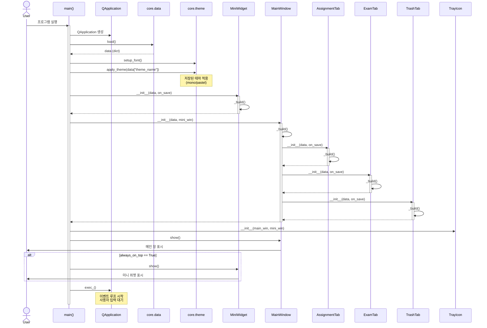
```mermaid
sequenceDiagram
    actor User
    participant Main as main()
    participant App as QApplication
    participant Data as core.data
    participant Theme as core.theme
    participant MiniWidget
    participant MainWindow
    participant AssignmentTab
    participant ExamTab
    participant TrashTab
    participant TrayIcon

    User->>Main: 프로그램 실행
    activate Main

    Main->>App: QApplication 생성
    Main->>Data: load()
    Data-->>Main: data (dict)

    Main->>Theme: setup_font()
    Main->>Theme: apply_theme(data["theme_name"])
    Note over Theme: 저장된 테마 적용<br/>(mono/pastel)

    Main->>MiniWidget: __init__(data, on_save)
    activate MiniWidget
    MiniWidget->>MiniWidget: _build()
    MiniWidget-->>Main: 
    deactivate MiniWidget

    Main->>MainWindow: __init__(data, mini_win)
    activate MainWindow
    MainWindow->>MainWindow: _build()

    MainWindow->>AssignmentTab: __init__(data, on_save)
    activate AssignmentTab
    AssignmentTab->>AssignmentTab: _build()
    AssignmentTab-->>MainWindow: 
    deactivate AssignmentTab

    MainWindow->>ExamTab: __init__(data, on_save)
    activate ExamTab
    ExamTab->>ExamTab: _build()
    ExamTab-->>MainWindow: 
    deactivate ExamTab

    MainWindow->>TrashTab: __init__(data, on_save)
    activate TrashTab
    TrashTab->>TrashTab: _build()
    TrashTab-->>MainWindow: 
    deactivate TrashTab

    MainWindow-->>Main: 
    deactivate MainWindow

    Main->>TrayIcon: __init__(main_win, mini_win)
    Main->>MainWindow: show()
    MainWindow->>User: 메인 창 표시

    alt always_on_top == True
        Main->>MiniWidget: show()
        MiniWidget->>User: 미니 위젯 표시
    end

    Main->>App: exec_()
    Note over App: 이벤트 루프 시작<br/>사용자 입력 대기

    deactivate Main
```
프로그램 실행부터 메인 창 표시까지의 전체 초기화 프로세스로, 사용자가 main.py를 실행했음/시스템에 저장된 data.json 파일이 존재함(혹은 신규 생성됨)이 시작 조건으로 지정된다. 
**실행 흐름**
1. main() 함수 실행
   - QApplication 인스턴스 생성
   - core.data.load()로 저장된 데이터 로드
   - setup_font()로 Pretendard 폰트 등록
   - apply_theme()로 저장된 테마 적용
2. MiniWidget 생성
   - __init__(data, on_save) 호출
   - _build()로 UI 구성 (타이머, 탭, 리스트)
3. MainWindow 생성
   - __init__(data, mini_win) 호출
   - _build()로 헤더, 탭바, 컨텐츠 영역 구성
   - 각 탭 (AssignmentTab, ExamTab, TrashTab) 생성
   - 각 탭의 _build()로 카드 목록 렌더링
4. TrayIcon 생성
   - 시스템 트레이에 아이콘 표시
   - 메뉴 (메인 창 열기, 미니 위젯 토글, 종료) 설정
5. 창 표시
   - MainWindow.show() 호출
   - always_on_top 설정 시 MiniWidget.show() 호출
   - app.exec_()로 이벤트 루프 시작
**종료 조건**
- 메인 창과 미니 위젯이 사용자에게 표시됨
- 이벤트 루프가 실행되어 사용자 입력 대기 상태
**주요 특징**
- 모든 탭이 초기화 시점에 한 번에 생성됨 (Lazy Loading 없음)
- MiniWidget은 MainWindow보다 먼저 생성 (참조 전달 목적)

---

### Use Case 2: 새 과제 추가

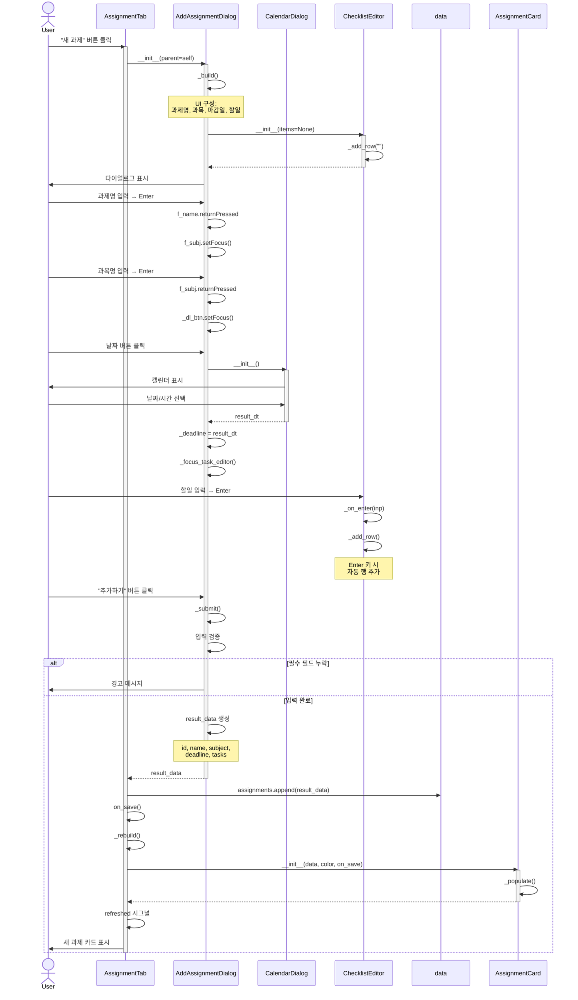
```mermaid
sequenceDiagram
    actor User
    participant AssignmentTab
    participant Dialog as AddAssignmentDialog
    participant Calendar as CalendarDialog
    participant Editor as ChecklistEditor
    participant Data as data
    participant Card as AssignmentCard

    User->>AssignmentTab: "새 과제" 버튼 클릭
    activate AssignmentTab

    AssignmentTab->>Dialog: __init__(parent=self)
    activate Dialog
    Dialog->>Dialog: _build()
    Note over Dialog: UI 구성:<br/>과제명, 과목, 마감일, 할일

    Dialog->>Editor: __init__(items=None)
    activate Editor
    Editor->>Editor: _add_row("")
    Editor-->>Dialog: 
    deactivate Editor

    Dialog->>User: 다이얼로그 표시

    User->>Dialog: 과제명 입력 → Enter
    Dialog->>Dialog: f_name.returnPressed
    Dialog->>Dialog: f_subj.setFocus()

    User->>Dialog: 과목명 입력 → Enter
    Dialog->>Dialog: f_subj.returnPressed
    Dialog->>Dialog: _dl_btn.setFocus()

    User->>Dialog: 날짜 버튼 클릭
    Dialog->>Calendar: __init__()
    activate Calendar
    Calendar->>User: 캘린더 표시
    User->>Calendar: 날짜/시간 선택
    Calendar-->>Dialog: result_dt
    deactivate Calendar

    Dialog->>Dialog: _deadline = result_dt
    Dialog->>Dialog: _focus_task_editor()

    User->>Editor: 할일 입력 → Enter
    Editor->>Editor: _on_enter(inp)
    Editor->>Editor: _add_row()
    Note over Editor: Enter 키 시<br/>자동 행 추가

    User->>Dialog: "추가하기" 버튼 클릭
    Dialog->>Dialog: _submit()
    Dialog->>Dialog: 입력 검증

    alt 필수 필드 누락
        Dialog->>User: 경고 메시지
    else 입력 완료
        Dialog->>Dialog: result_data 생성
        Note over Dialog: id, name, subject,<br/>deadline, tasks
        Dialog-->>AssignmentTab: result_data
        deactivate Dialog

        AssignmentTab->>Data: assignments.append(result_data)
        AssignmentTab->>AssignmentTab: on_save()
        AssignmentTab->>AssignmentTab: _rebuild()

        AssignmentTab->>Card: __init__(data, color, on_save)
        activate Card
        Card->>Card: _populate()
        Card-->>AssignmentTab: 
        deactivate Card

        AssignmentTab->>AssignmentTab: refreshed 시그널
        AssignmentTab->>User: 새 과제 카드 표시
    end

    deactivate AssignmentTab
```
사용자가 새 과제를 추가하는 전체 프로세스로, 메인 창의 '과제 관리 탭'이 활성화 되었으며 사용자가 '새 과제' 버튼을 클릭한 것이 시작 조건이다. 
**실행 흐름**
1. 다이얼로그 생성 및 표시
   - AssignmentTab._add() 메서드 호출
   - AddAssignmentDialog.__init__(parent=self) 생성
   - _build()로 폼 UI 구성 (과제명, 과목, 마감일, 할일)
   - ChecklistEditor 인스턴스 생성 및 초기 빈 행 추가
2. 사용자 입력
   - 과제명 입력 → Enter → 과목명 필드로 포커스 이동
   - 과목명 입력 → Enter → 마감일 버튼으로 포커스 이동
   - 마감일 버튼 클릭/Enter → CalendarDialog 표시
   - 날짜 및 시간 선택 → result_dt 반환
   - 할일 에디터로 포커스 자동 이동 (_focus_task_editor)
3. 할일 목록 입력
   - ChecklistEditor에서 첫 번째 할일 입력
   - Enter 키 시 _on_enter() 호출 → 다음 행 자동 추가
   - 반복하여 여러 할일 추가 가능
4. 데이터 검증 및 저장
   - "추가하기" 버튼 클릭 → _submit() 호출
   - 필수 필드 검증 (과제명, 과목명)
   - 누락 시 경고 메시지, 완료 시 result_data 생성
5. UI 업데이트
   - data["assignments"].append(result_data)
   - AssignmentTab._rebuild() 호출
   - 새 AssignmentCard 생성 및 _populate()
   - refreshed 시그널 발생 → MainWindow로 전파
 **종료 조건**
• 새 과제 카드가 과제 탭에 표시됨
• 데이터가 파일에 저장됨
• 미니 위젯의 과제 목록도 업데이트됨
 **대안 흐름**
• 필수 필드 누락 시: 경고 다이얼로그 표시 후 입력 화면 유지
• 사용자 취소 시: 다이얼로그 닫히고 데이터 변경 없음

---

### Use Case 3: 과제 수정

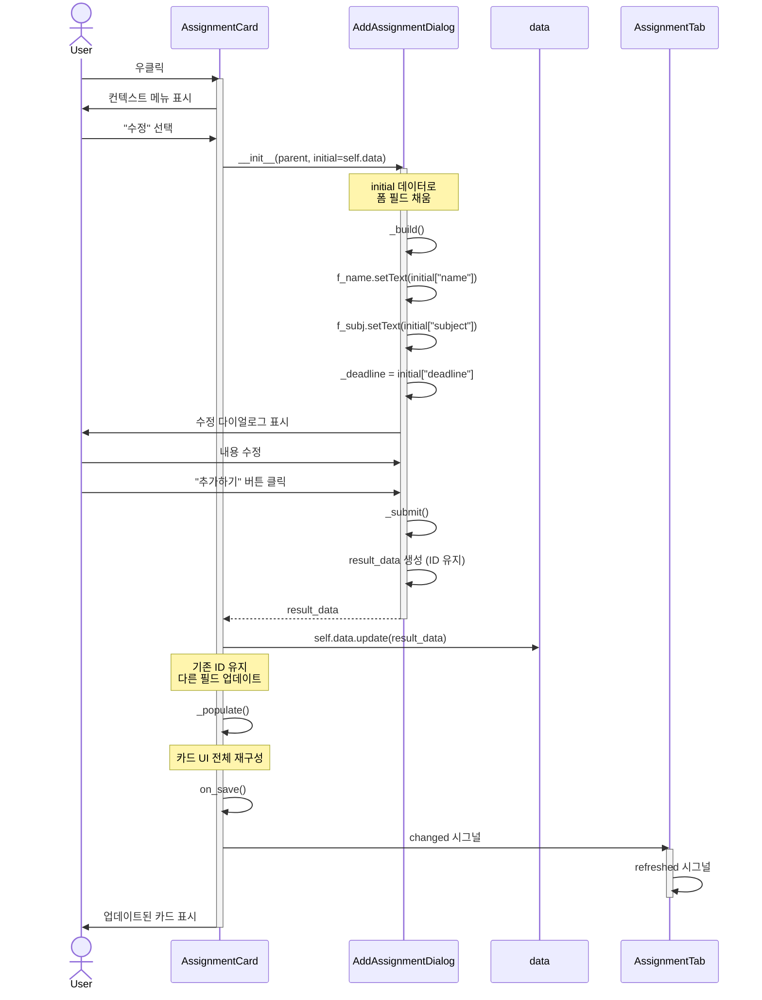
```mermaid
sequenceDiagram
    actor User
    participant Card as AssignmentCard
    participant Dialog as AddAssignmentDialog
    participant Data as data
    participant Tab as AssignmentTab

    User->>Card: 우클릭
    activate Card
    Card->>User: 컨텍스트 메뉴 표시

    User->>Card: "수정" 선택
    Card->>Dialog: __init__(parent, initial=self.data)
    activate Dialog

    Note over Dialog: initial 데이터로<br/>폼 필드 채움

    Dialog->>Dialog: _build()
    Dialog->>Dialog: f_name.setText(initial["name"])
    Dialog->>Dialog: f_subj.setText(initial["subject"])
    Dialog->>Dialog: _deadline = initial["deadline"]

    Dialog->>User: 수정 다이얼로그 표시

    User->>Dialog: 내용 수정
    User->>Dialog: "추가하기" 버튼 클릭

    Dialog->>Dialog: _submit()
    Dialog->>Dialog: result_data 생성 (ID 유지)
    Dialog-->>Card: result_data
    deactivate Dialog

    Card->>Data: self.data.update(result_data)
    Note over Card: 기존 ID 유지<br/>다른 필드 업데이트

    Card->>Card: _populate()
    Note over Card: 카드 UI 전체 재구성

    Card->>Card: on_save()
    Card->>Tab: changed 시그널
    activate Tab
    Tab->>Tab: refreshed 시그널
    deactivate Tab

    Card->>User: 업데이트된 카드 표시
    deactivate Card
```
기존 과제의 정보를 수정하는 프로세스로, 과제 카드가 화면에 표시되어 있으며 사용자가 우클릭하여 '수정'을 클릭했음이 시작 조건이다.
 **실행 흐름**
1. 수정 다이얼로그 열기
   - AssignmentCard.contextMenuEvent() 처리
   - _edit() 메서드 호출
   - AddAssignmentDialog(parent, initial=self.data) 생성
2. 기존 데이터 로드
   - _build() 시 initial 데이터로 폼 필드 채움
   - f_name.setText(initial["name"])
   - f_subj.setText(initial["subject"])
   - _deadline = initial["deadline"]
   - ChecklistEditor에 기존 tasks 로드
3. 수정 및 저장
   - 사용자가 필드 내용 수정
   - "추가하기" 버튼 클릭 → _submit()
   - result_data 생성 (기존 ID 유지)
4. 카드 업데이트
   - self.data.update(result_data)
   - _populate() 호출하여 카드 UI 전체 재구성
   - on_save()로 데이터 파일 저장
   - changed 시그널 → refreshed 시그널 체인
 **종료 조건**
- 과제 카드가 수정된 내용으로 업데이트됨
- 다른 탭 및 미니 위젯에도 변경사항 반영됨
 **주요 특징**
- ID는 변경되지 않고 유지됨
- 같은 AddAssignmentDialog를 추가와 수정 모두에 사용 (initial 매개변수로 구분)

---

### Use Case 4: 할일 체크박스 토글

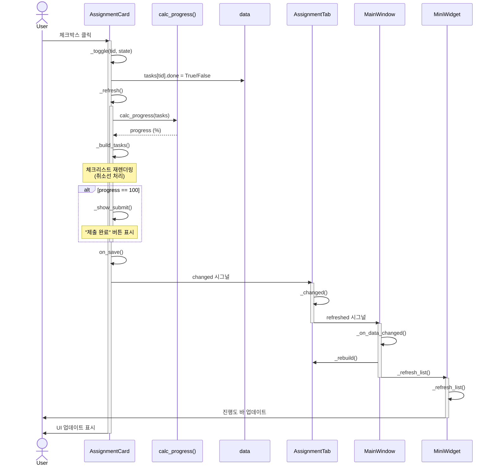
```mermaid
sequenceDiagram
    actor User
    participant Card as AssignmentCard
    participant CalcProg as calc_progress()
    participant Data as data
    participant Tab as AssignmentTab
    participant MainWindow
    participant MiniWidget

    User->>Card: 체크박스 클릭
    activate Card

    Card->>Card: _toggle(tid, state)
    Card->>Data: tasks[tid].done = True/False

    Card->>Card: _refresh()
    activate Card

    Card->>CalcProg: calc_progress(tasks)
    CalcProg-->>Card: progress (%)

    Card->>Card: _build_tasks()
    Note over Card: 체크리스트 재렌더링<br/>(취소선 처리)

    alt progress == 100
        Card->>Card: _show_submit()
        Note over Card: "제출 완료" 버튼 표시
    end

    deactivate Card

    Card->>Card: on_save()
    Card->>Tab: changed 시그널
    activate Tab
    Tab->>Tab: _changed()
    Tab->>MainWindow: refreshed 시그널
    deactivate Tab

    activate MainWindow
    MainWindow->>MainWindow: _on_data_changed()
    MainWindow->>Tab: _rebuild()
    MainWindow->>MiniWidget: _refresh_list()
    deactivate MainWindow

    activate MiniWidget
    MiniWidget->>MiniWidget: _refresh_list()
    MiniWidget->>User: 진행도 바 업데이트
    deactivate MiniWidget

    Card->>User: UI 업데이트 표시
    deactivate Card
```
과제 카드에서 할일 체크박스를 토글하는 프로세스로, 과제 카드가 표시되어 있으며 할일 목록이 1개 이상 존재할 것이 시작 조건이다.
 **실행 흐름**
1. 체크박스 클릭
   - QCheckBox.stateChanged 시그널 발생
   - AssignmentCard._toggle(tid, state) 호출
2. 데이터 업데이트
   - tasks 배열에서 해당 ID 찾기
   - task["done"] = (state == Qt.Checked)
3. UI 새로고침
   - _refresh() 호출
   - calc_progress(tasks)로 진행도 재계산
   - _pct 레이블 및 _pbar 프로그레스바 업데이트
   - _build_tasks()로 할일 목록 재렌더링 (취소선 적용)
4. 100% 완료 처리
   - progress == 100일 경우 _show_submit() 호출
   - "제출 완료 — 목록에서 삭제" 버튼 표시
5. 시그널 체인
   - on_save() 호출 → 파일 저장
   - changed 시그널 → AssignmentTab
   - refreshed 시그널 → MainWindow
   - _on_data_changed() → 모든 탭 리빌드 + MiniWidget 새로고침
 **종료 조건**
- 체크박스 상태가 UI에 반영됨
- 진행도 바가 업데이트됨
- 미니 위젯에도 진행도 변경사항 반영됨
 **주요 특징**
- 단일 체크박스 토글이 전체 애플리케이션 UI 업데이트를 트리거
- 시그널 체인으로 느슨한 결합 유지
- 진행도 100% 시 제출 버튼 자동 표시

---

### Use Case 5: 새 시험 추가

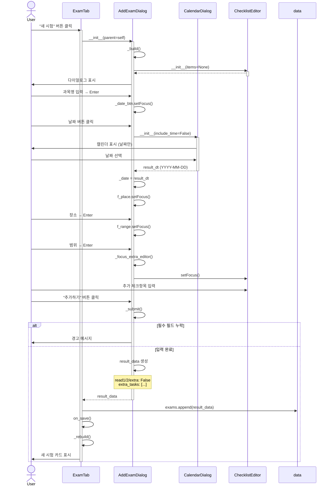
```mermaid
sequenceDiagram
    actor User
    participant ExamTab
    participant Dialog as AddExamDialog
    participant Calendar as CalendarDialog
    participant Editor as ChecklistEditor
    participant Data as data

    User->>ExamTab: "새 시험" 버튼 클릭
    activate ExamTab

    ExamTab->>Dialog: __init__(parent=self)
    activate Dialog
    Dialog->>Dialog: _build()

    Dialog->>Editor: __init__(items=None)
    activate Editor
    Editor-->>Dialog: 
    deactivate Editor

    Dialog->>User: 다이얼로그 표시

    User->>Dialog: 과목명 입력 → Enter
    Dialog->>Dialog: _date_btn.setFocus()

    User->>Dialog: 날짜 버튼 클릭
    Dialog->>Calendar: __init__(include_time=False)
    activate Calendar
    Calendar->>User: 캘린더 표시 (날짜만)
    User->>Calendar: 날짜 선택
    Calendar-->>Dialog: result_dt (YYYY-MM-DD)
    deactivate Calendar

    Dialog->>Dialog: _date = result_dt
    Dialog->>Dialog: f_place.setFocus()

    User->>Dialog: 장소 → Enter
    Dialog->>Dialog: f_range.setFocus()

    User->>Dialog: 범위 → Enter
    Dialog->>Dialog: _focus_extra_editor()
    Dialog->>Editor: setFocus()

    User->>Editor: 추가 체크항목 입력
    User->>Dialog: "추가하기" 버튼 클릭

    Dialog->>Dialog: _submit()

    alt 필수 필드 누락
        Dialog->>User: 경고 메시지
    else 입력 완료
        Dialog->>Dialog: result_data 생성
        Note over Dialog: read1/2/extra: False<br/>extra_tasks: [...]
        Dialog-->>ExamTab: result_data
        deactivate Dialog

        ExamTab->>Data: exams.append(result_data)
        ExamTab->>ExamTab: on_save()
        ExamTab->>ExamTab: _rebuild()
        ExamTab->>User: 새 시험 카드 표시
    end

    deactivate ExamTab
```
사용자가 새 시험 일정을 추가하는 프로세스로, '시험공부 관리' 탭이 활성화 되었으며 '새 시험' 버튼이 클릭됨이 시작 조건이다.
 **실행 흐름**
1. 다이얼로그 생성
   - ExamTab._add() 호출
   - AddExamDialog.__init__(parent=self) 생성
   - _build()로 폼 구성 (과목, 날짜, 장소, 범위, 추가 체크리스트)
2. 입력 흐름
   - 과목명 → Enter → 날짜 버튼 포커스
   - 날짜 버튼 클릭 → CalendarDialog (시간 없음, 날짜만)
   - 날짜 선택 후 → 시험 장소 필드 포커스
   - 장소 → Enter → 범위 필드 포커스
   - 범위 → Enter → 추가 체크리스트 에디터 포커스
3. 데이터 생성
   - "추가하기" 클릭 → _submit()
   - 필수 필드 검증 (과목명, 날짜)
   - result_data 생성:
     - read1, read2, read_extra: False (초기값)
     - extra_tasks: ChecklistEditor의 get_items() 결과
4. UI 업데이트
   - data["exams"].append(result_data)
   - ExamTab._rebuild()
   - ExamCard 생성 및 표시
 **종료 조건**
- 새 시험 카드가 시험 탭에 표시됨
- 고정 체크리스트 (1회독, 2회독, 추가 회독) 표시됨
 **주요 특징**
- 과제와 달리 시간 없이 날짜만 입력
- 고정 체크리스트 3개 + 커스텀 체크리스트 조합

---

### Use Case 6: 테마 변경

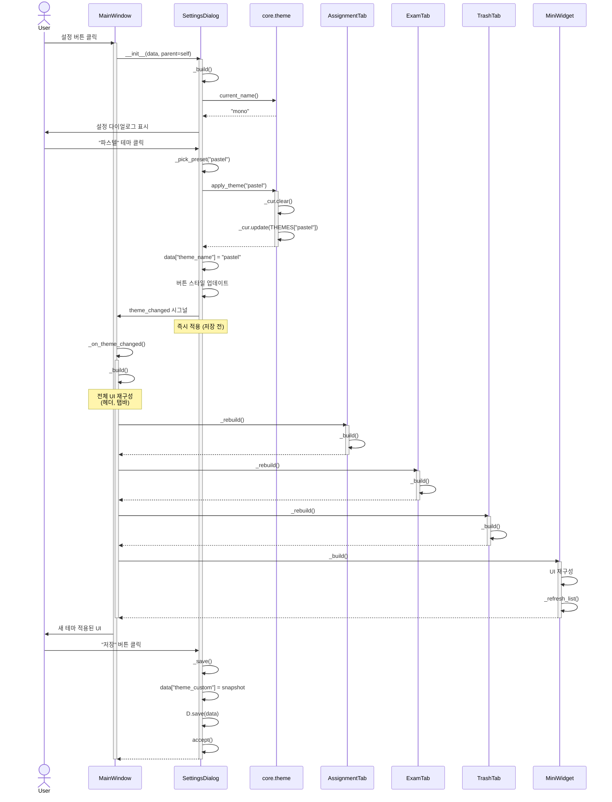
```mermaid
sequenceDiagram
    actor User
    participant MainWindow
    participant Settings as SettingsDialog
    participant Theme as core.theme
    participant AssignmentTab
    participant ExamTab
    participant TrashTab
    participant MiniWidget

    User->>MainWindow: 설정 버튼 클릭
    activate MainWindow

    MainWindow->>Settings: __init__(data, parent=self)
    activate Settings
    Settings->>Settings: _build()
    Settings->>Theme: current_name()
    Theme-->>Settings: "mono"

    Settings->>User: 설정 다이얼로그 표시

    User->>Settings: "파스텔" 테마 클릭
    Settings->>Settings: _pick_preset("pastel")

    Settings->>Theme: apply_theme("pastel")
    activate Theme
    Theme->>Theme: _cur.clear()
    Theme->>Theme: _cur.update(THEMES["pastel"])
    Theme-->>Settings: 
    deactivate Theme

    Settings->>Settings: data["theme_name"] = "pastel"
    Settings->>Settings: 버튼 스타일 업데이트

    Settings->>MainWindow: theme_changed 시그널
    Note over Settings: 즉시 적용 (저장 전)

    MainWindow->>MainWindow: _on_theme_changed()
    activate MainWindow

    MainWindow->>MainWindow: _build()
    Note over MainWindow: 전체 UI 재구성<br/>(헤더, 탭바)

    MainWindow->>AssignmentTab: _rebuild()
    activate AssignmentTab
    AssignmentTab->>AssignmentTab: _build()
    AssignmentTab-->>MainWindow: 
    deactivate AssignmentTab

    MainWindow->>ExamTab: _rebuild()
    activate ExamTab
    ExamTab->>ExamTab: _build()
    ExamTab-->>MainWindow: 
    deactivate ExamTab

    MainWindow->>TrashTab: _rebuild()
    activate TrashTab
    TrashTab->>TrashTab: _build()
    TrashTab-->>MainWindow: 
    deactivate TrashTab

    MainWindow->>MiniWidget: _build()
    activate MiniWidget
    MiniWidget->>MiniWidget: UI 재구성
    MiniWidget->>MiniWidget: _refresh_list()
    MiniWidget-->>MainWindow: 
    deactivate MiniWidget

    deactivate MainWindow

    MainWindow->>User: 새 테마 적용된 UI

    User->>Settings: "저장" 버튼 클릭
    Settings->>Settings: _save()
    Settings->>Settings: data["theme_custom"] = snapshot
    Settings->>Settings: D.save(data)
    Settings->>Settings: accept()
    Settings-->>MainWindow: 
    deactivate Settings

    deactivate MainWindow
```
애플리케이션 테마를 변경하고 즉시 적용하는 프로세스로, 메인 창이 표시되어 있으며 설정 버튼이 클릭되었음이 시작 조건이다.
 **실행 흐름**
1. 설정 다이얼로그 열기
   - MainWindow._open_settings() 호출
   - SettingsDialog.__init__(data, parent=self)
   - 현재 테마로 버튼 초기화
2. 테마 선택
   - 사용자가 "파스텔" 버튼 클릭
   - _pick_preset("pastel") 호출
   - apply_theme("pastel") 실행
   - theme.py의 _cur 딕셔너리 업데이트
3. 즉시 적용
   - theme_changed 시그널 발생 (저장 전)
   - MainWindow._on_theme_changed() 호출
   - MainWindow._build() → 전체 헤더/탭바 재구성
   - 모든 탭 _rebuild()
   - MiniWidget._build() 및 _refresh_list()
4. 설정 저장
   - 사용자가 "저장" 버튼 클릭
   - _save() 호출
   - data["theme_custom"] = current_snapshot()
   - D.save(data) → 파일에 영구 저장
 **종료 조건**
- 전체 UI가 새 테마 색상으로 표시됨
- 다음 실행 시에도 선택한 테마가 유지됨
 **주요 특징**
- 즉시 적용 (Live Preview) 지원
- 전체 UI 재구성으로 모든 위젯에 테마 반영
- 개별 색상 커스터마이징도 동일한 흐름

---

### Use Case 7: 미니 위젯 - 체크리스트 팝업

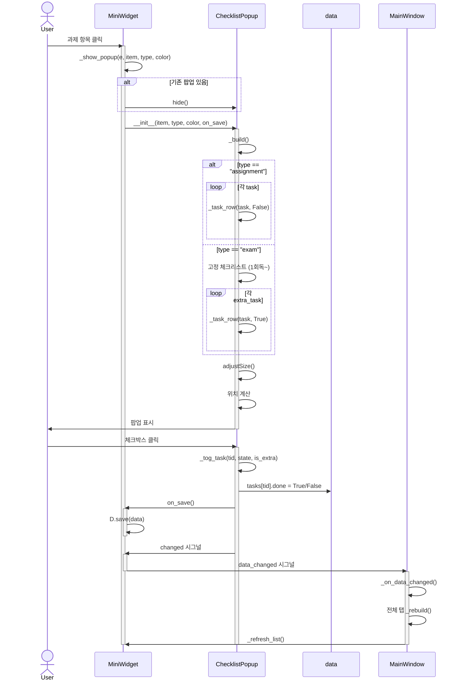
```mermaid
sequenceDiagram
    actor User
    participant MiniWidget
    participant Popup as ChecklistPopup
    participant Data as data
    participant MainWindow

    User->>MiniWidget: 과제 항목 클릭
    activate MiniWidget

    MiniWidget->>MiniWidget: _show_popup(e, item, type, color)

    alt 기존 팝업 있음
        MiniWidget->>Popup: hide()
    end

    MiniWidget->>Popup: __init__(item, type, color, on_save)
    activate Popup
    Popup->>Popup: _build()

    alt type == "assignment"
        loop 각 task
            Popup->>Popup: _task_row(task, False)
        end
    else type == "exam"
        Popup->>Popup: 고정 체크리스트 (1회독~)
        loop 각 extra_task
            Popup->>Popup: _task_row(task, True)
        end
    end

    Popup->>Popup: adjustSize()
    Popup->>Popup: 위치 계산
    Popup->>User: 팝업 표시
    deactivate Popup

    User->>Popup: 체크박스 클릭
    activate Popup
    Popup->>Popup: _tog_task(tid, state, is_extra)
    Popup->>Data: tasks[tid].done = True/False

    Popup->>MiniWidget: on_save()
    activate MiniWidget
    MiniWidget->>MiniWidget: D.save(data)
    deactivate MiniWidget

    Popup->>MiniWidget: changed 시그널
    activate MiniWidget
    MiniWidget->>MainWindow: data_changed 시그널
    deactivate MiniWidget

    activate MainWindow
    MainWindow->>MainWindow: _on_data_changed()
    MainWindow->>MainWindow: 전체 탭 _rebuild()
    MainWindow->>MiniWidget: _refresh_list()
    deactivate MainWindow

    deactivate Popup
    deactivate MiniWidget
```
- 미니 위젯에서 과제/시험 항목 클릭
- ChecklistPopup 생성 및 위치 계산
- 타입에 따라 동적 UI 구성 (과제: tasks, 시험: read1~3 + extra_tasks)
- 체크박스 토글 시 changed 시그널 → data_changed → MainWindow._on_data_changed()
- 메인 창 및 미니 위젯 모두 동기화

---

### Use Case 8: 타이머 제어

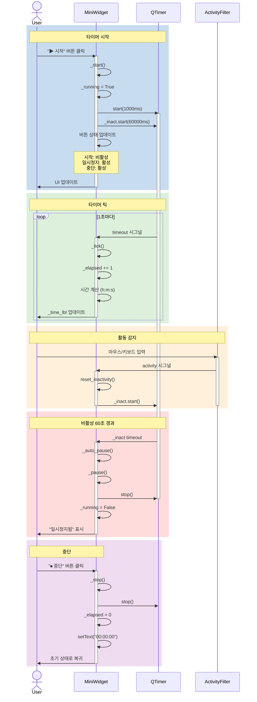
```mermaid
sequenceDiagram
    actor User
    participant MiniWidget
    participant Timer as QTimer
    participant ActivityFilter

    rect rgb(200, 220, 240)
    Note over User,Timer: 타이머 시작
    User->>MiniWidget: "▶ 시작" 버튼 클릭
    activate MiniWidget

    MiniWidget->>MiniWidget: _start()
    MiniWidget->>MiniWidget: _running = True
    MiniWidget->>Timer: start(1000ms)
    activate Timer

    MiniWidget->>Timer: _inact.start(60000ms)

    MiniWidget->>MiniWidget: 버튼 상태 업데이트
    Note over MiniWidget: 시작: 비활성<br/>일시정지: 활성<br/>중단: 활성

    MiniWidget->>User: UI 업데이트
    deactivate MiniWidget
    end

    rect rgb(220, 240, 220)
    Note over User,Timer: 타이머 틱
    loop 1초마다
        Timer->>MiniWidget: timeout 시그널
        activate MiniWidget
        MiniWidget->>MiniWidget: _tick()
        MiniWidget->>MiniWidget: _elapsed += 1
        MiniWidget->>MiniWidget: 시간 계산 (h:m:s)
        MiniWidget->>User: _time_lbl 업데이트
        deactivate MiniWidget
    end
    end

    rect rgb(255, 240, 220)
    Note over User,ActivityFilter: 활동 감지
    User->>ActivityFilter: 마우스/키보드 입력
    activate ActivityFilter
    ActivityFilter->>MiniWidget: activity 시그널
    activate MiniWidget
    MiniWidget->>MiniWidget: reset_inactivity()
    MiniWidget->>Timer: _inact.start()
    deactivate MiniWidget
    deactivate ActivityFilter
    end

    rect rgb(255, 220, 220)
    Note over User,Timer: 비활성 60초 경과
    Timer->>MiniWidget: _inact timeout
    activate MiniWidget
    MiniWidget->>MiniWidget: _auto_pause()
    MiniWidget->>MiniWidget: _pause()
    MiniWidget->>Timer: stop()
    deactivate Timer
    MiniWidget->>MiniWidget: _running = False
    MiniWidget->>User: "일시정지됨" 표시
    deactivate MiniWidget
    end

    rect rgb(240, 220, 240)
    Note over User,MiniWidget: 중단
    User->>MiniWidget: "⏹ 중단" 버튼 클릭
    activate MiniWidget
    MiniWidget->>MiniWidget: _stop()
    MiniWidget->>Timer: stop()
    MiniWidget->>MiniWidget: _elapsed = 0
    MiniWidget->>MiniWidget: setText("00:00:00")
    MiniWidget->>User: 초기 상태로 복귀
    deactivate MiniWidget
    end
```
- 시작 버튼: _start() → QTimer.start(1000ms)
- 1초마다 _tick() → _elapsed += 1 → UI 업데이트
- 비활성 타이머: 60초 후 _auto_pause() → 자동 일시정지
- ActivityFilter: 사용자 활동 감지 → reset_inactivity()
- 일시정지: _pause() → QTimer.stop()
- 중단: _stop() → _elapsed = 0 → "00:00:00"

---

### Use Case 9: 과제 삭제

```mermaid
sequenceDiagram
    actor User
    participant Card as AssignmentCard
    participant Confirm as ConfirmDialog
    participant Data as data
    participant Tab as AssignmentTab
    participant TrashTab
    participant MainWindow

    User->>Card: 삭제 버튼 클릭
    activate Card

    Card->>Confirm: __init__(title, message, ...)
    activate Confirm
    Confirm->>User: 확인 다이얼로그 표시
    User->>Confirm: "삭제" 버튼 클릭

    alt 사용자 확인
        Confirm->>Confirm: accept()
        Confirm-->>Card: Accepted
        deactivate Confirm

        Card->>Card: on_save()
        Card->>Tab: deleted 시그널 (id)

        activate Tab
        Tab->>Tab: _delete(aid)
        Tab->>Data: 과제 찾기

        Tab->>Data: assignments에서 제거
        Note over Tab: removed 저장<br/>assignments 필터링

        Tab->>Data: deleted 배열에 추가
        Note over Tab: _deleted_at 추가

        Tab->>Tab: on_save()
        Tab->>Tab: _rebuild()
        Tab->>MainWindow: refreshed 시그널
        deactivate Tab

        activate MainWindow
        MainWindow->>MainWindow: _on_data_changed()
        MainWindow->>TrashTab: _rebuild()
        activate TrashTab
        TrashTab->>TrashTab: _build()
        TrashTab->>User: 휴지통에 항목 표시
        deactivate TrashTab
        deactivate MainWindow

    else 사용자 취소
        Confirm->>Confirm: reject()
        Confirm-->>Card: Rejected
        deactivate Confirm
    end

    deactivate Card
```
- 삭제 버튼 클릭 → ConfirmDialog 표시
- 확인 시: deleted 시그널 발생
- AssignmentTab._delete(aid): assignments 배열에서 제거
- deleted 배열에 추가 (+ _deleted_at 타임스탬프)
- _rebuild() → refreshed 시그널 → TrashTab 업데이트

---

### Use Case 10: 휴지통 비우기

```mermaid
sequenceDiagram
    actor User
    participant TrashTab
    participant Confirm as ConfirmDialog
    participant Data as data

    User->>TrashTab: "전체 삭제" 버튼 클릭
    activate TrashTab

    TrashTab->>Confirm: __init__(title, message, ...)
    activate Confirm
    Confirm->>User: 확인 다이얼로그 표시
    Note over Confirm: "휴지통의 모든 항목을<br/>영구 삭제할까요?<br/>되돌릴 수 없습니다."

    User->>Confirm: "전체 삭제" 버튼 클릭

    alt 사용자 확인
        Confirm->>Confirm: accept()
        Confirm-->>TrashTab: Accepted
        deactivate Confirm

        TrashTab->>Data: data["deleted"] = []
        TrashTab->>TrashTab: on_save()
        TrashTab->>TrashTab: _rebuild()

        TrashTab->>TrashTab: _build()
        Note over TrashTab: 빈 휴지통 UI<br/>"휴지통이 비어있어요 🗑"

        TrashTab->>TrashTab: refreshed 시그널
        TrashTab->>User: 빈 휴지통 표시

    else 사용자 취소
        Confirm->>Confirm: reject()
        Confirm-->>TrashTab: Rejected
        deactivate Confirm
    end

    deactivate TrashTab
```
- "전체 삭제" 버튼 클릭 → ConfirmDialog
- 확인 시: data["deleted"] = []
- on_save() → 파일 저장
- _rebuild() → 빈 휴지통 UI 표시

---

## 5. State machine diagram
본 프로그램의 State machine diagram은 다음과 같다. 

### 1. 애플리케이션 전체 생명주기

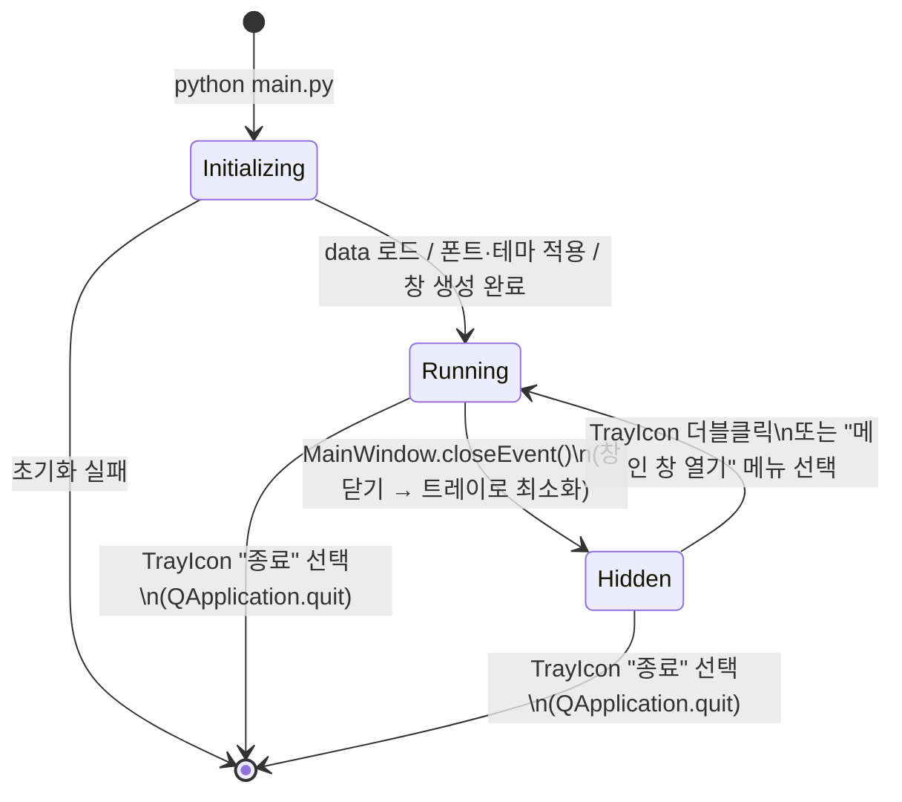
```mermaid
stateDiagram-v2
    [*] --> Initializing : python main.py

    Initializing --> Running : data 로드 / 폰트·테마 적용 / 창 생성 완료
    Initializing --> [*] : 초기화 실패

    Running --> Hidden : MainWindow.closeEvent()\n(창 닫기 → 트레이로 최소화)
    Hidden --> Running : TrayIcon 더블클릭\n또는 "메인 창 열기" 메뉴 선택

    Running --> [*] : TrayIcon "종료" 선택\n(QApplication.quit)
    Hidden --> [*] : TrayIcon "종료" 선택\n(QApplication.quit)
```

---

### 2. MainWindow — 탭 전환

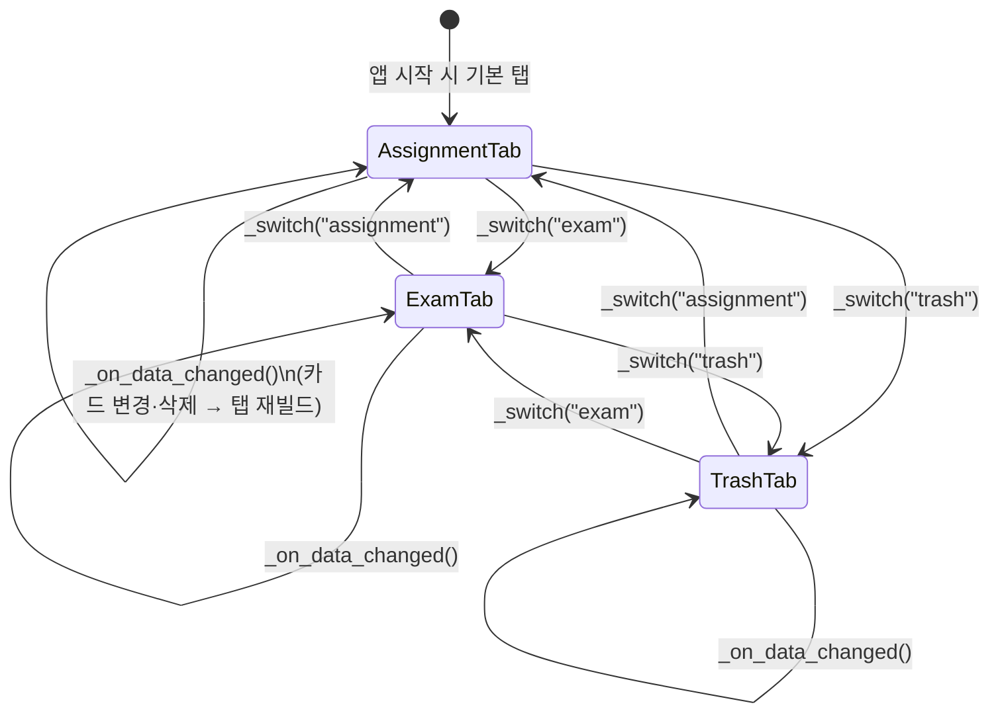
```mermaid
stateDiagram-v2
    [*] --> AssignmentTab : 앱 시작 시 기본 탭

    AssignmentTab --> ExamTab      : _switch("exam")
    AssignmentTab --> TrashTab     : _switch("trash")
    ExamTab       --> AssignmentTab : _switch("assignment")
    ExamTab       --> TrashTab     : _switch("trash")
    TrashTab      --> AssignmentTab : _switch("assignment")
    TrashTab      --> ExamTab      : _switch("exam")

    AssignmentTab --> AssignmentTab : _on_data_changed()\n(카드 변경·삭제 → 탭 재빌드)
    ExamTab       --> ExamTab      : _on_data_changed()
    TrashTab      --> TrashTab     : _on_data_changed()
```

---

### 3. MainWindow — 테마 / 설정

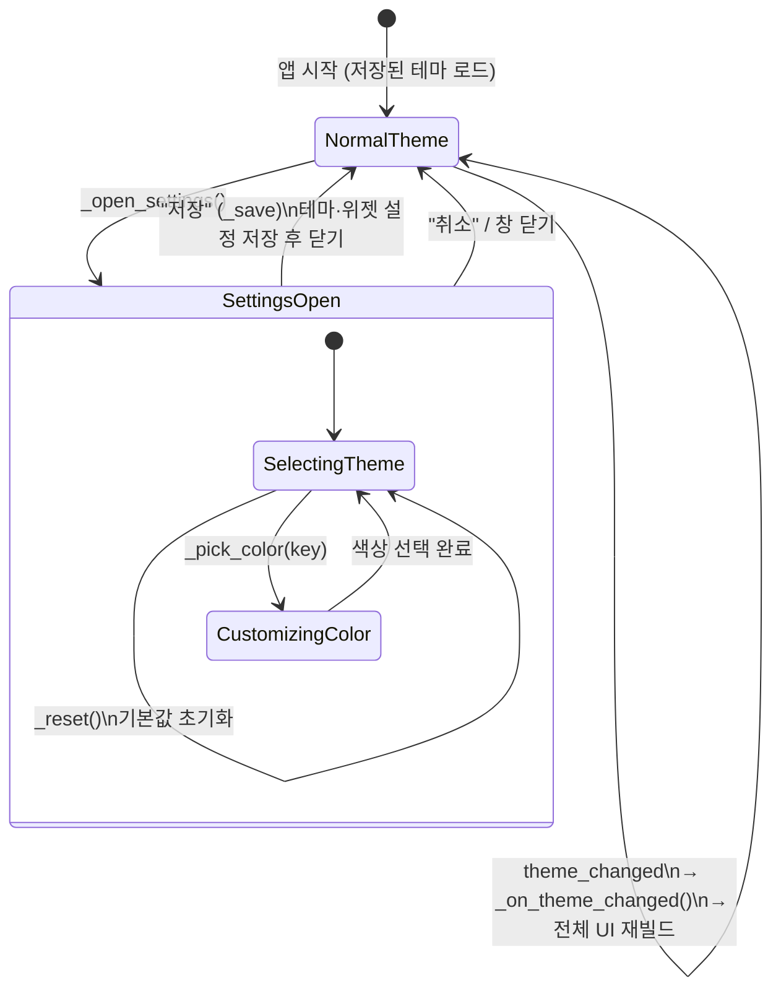
```mermaid
stateDiagram-v2
    [*] --> NormalTheme : 앱 시작 (저장된 테마 로드)

    NormalTheme --> SettingsOpen : _open_settings()

    state SettingsOpen {
        [*] --> SelectingTheme
        SelectingTheme --> SelectingTheme : _pick_preset(name)\n프리셋 변경 → theme_changed emit
        SelectingTheme --> CustomizingColor : _pick_color(key)
        CustomizingColor --> SelectingTheme : 색상 선택 완료
        SelectingTheme --> SelectingTheme : _reset()\n기본값 초기화
    }

    SettingsOpen --> NormalTheme  : "저장" (_save)\n테마·위젯 설정 저장 후 닫기
    SettingsOpen --> NormalTheme  : "취소" / 창 닫기

    NormalTheme --> NormalTheme   : theme_changed\n→ _on_theme_changed()\n→ 전체 UI 재빌드
```

---

### 4. MainWindow — 항상 위 고정 (Always-on-Top)

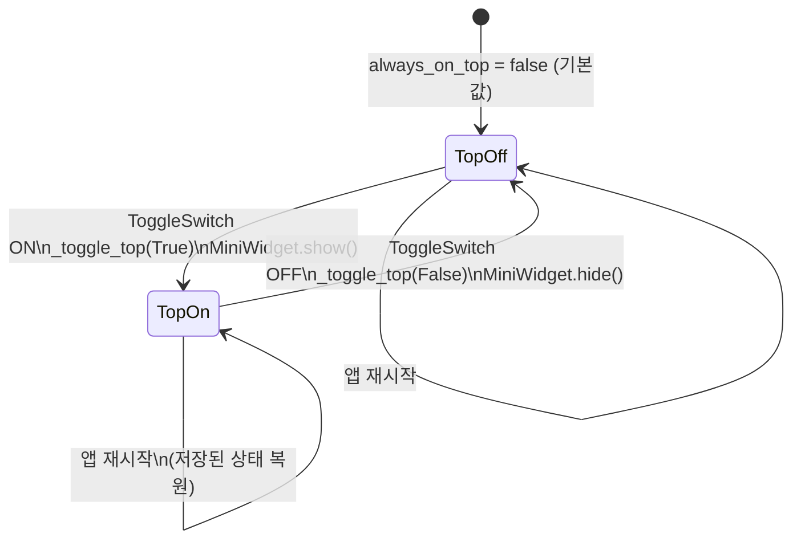
```mermaid
stateDiagram-v2
    [*] --> TopOff : always_on_top = false (기본값)

    TopOff --> TopOn  : ToggleSwitch ON\n_toggle_top(True)\nMiniWidget.show()
    TopOn  --> TopOff : ToggleSwitch OFF\n_toggle_top(False)\nMiniWidget.hide()

    TopOn  --> TopOn  : 앱 재시작\n(저장된 상태 복원)
    TopOff --> TopOff : 앱 재시작
```

---

### 5. AssignmentCard — 과제 카드 상태

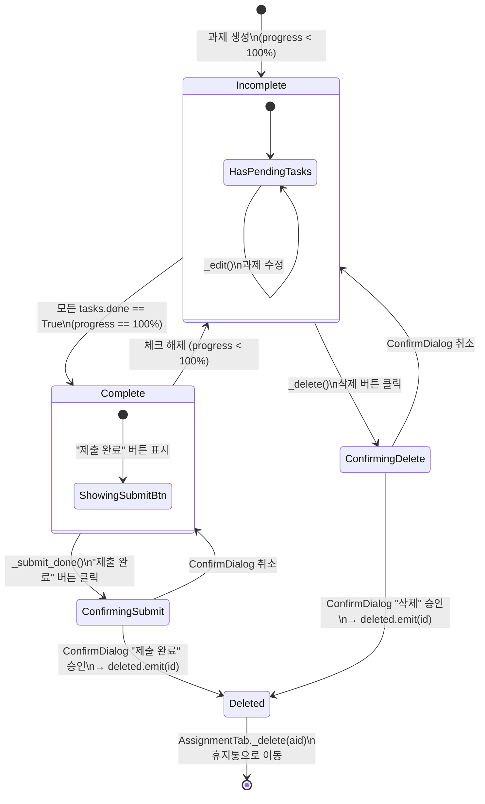
```mermaid
stateDiagram-v2
    [*] --> Incomplete : 과제 생성\n(progress < 100%)

    state Incomplete {
        [*] --> HasPendingTasks
        HasPendingTasks --> HasPendingTasks : _toggle(tid)\n(할일 체크/해제)
        HasPendingTasks --> HasPendingTasks : _add_task()\n새 할일 추가
        HasPendingTasks --> HasPendingTasks : _del_task(tid)\n할일 삭제
        HasPendingTasks --> HasPendingTasks : _pick_color()\n색상 변경
        HasPendingTasks --> HasPendingTasks : _edit()\n과제 수정
    }

    Incomplete --> Complete     : 모든 tasks.done == True\n(progress == 100%)
    Complete   --> Incomplete   : 체크 해제 (progress < 100%)

    state Complete {
        [*] --> ShowingSubmitBtn : "제출 완료" 버튼 표시
    }

    Complete --> ConfirmingSubmit : _submit_done()\n"제출 완료" 버튼 클릭
    ConfirmingSubmit --> Deleted  : ConfirmDialog "제출 완료" 승인\n→ deleted.emit(id)
    ConfirmingSubmit --> Complete : ConfirmDialog 취소

    Incomplete --> ConfirmingDelete : _delete()\n삭제 버튼 클릭
    ConfirmingDelete --> Deleted    : ConfirmDialog "삭제" 승인\n→ deleted.emit(id)
    ConfirmingDelete --> Incomplete : ConfirmDialog 취소

    Deleted --> [*] : AssignmentTab._delete(aid)\n휴지통으로 이동
```

---

### 6. ExamCard — 시험 카드 상태

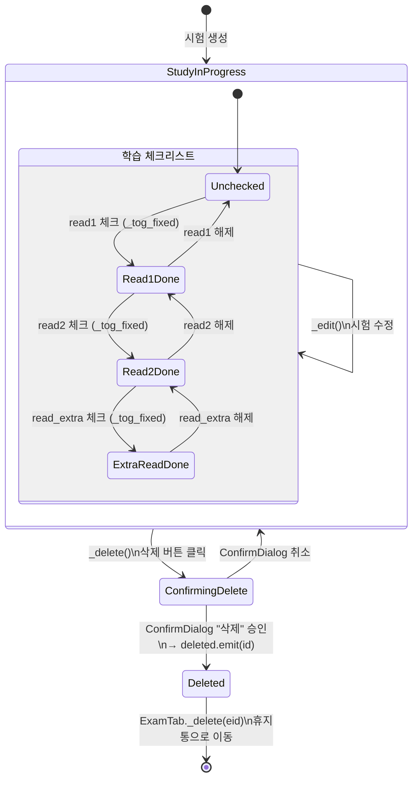
```mermaid
stateDiagram-v2
    [*] --> StudyInProgress : 시험 생성

    state StudyInProgress {
        [*] --> Unchecked

        state "학습 체크리스트" as Checklist {
            Unchecked --> Read1Done     : read1 체크 (_tog_fixed)
            Read1Done --> Read2Done     : read2 체크 (_tog_fixed)
            Read2Done --> ExtraReadDone : read_extra 체크 (_tog_fixed)
            Read1Done --> Unchecked     : read1 해제
            Read2Done --> Read1Done     : read2 해제
            ExtraReadDone --> Read2Done : read_extra 해제
        }

        Checklist --> Checklist : _add_extra()\n추가 항목 추가
        Checklist --> Checklist : _tog_extra(tid)\n추가 항목 체크/해제
        Checklist --> Checklist : _del_extra(tid)\n추가 항목 삭제
        Checklist --> Checklist : _pick_color()\n색상 변경
        Checklist --> Checklist : _edit()\n시험 수정
    }

    StudyInProgress --> ConfirmingDelete : _delete()\n삭제 버튼 클릭
    ConfirmingDelete --> Deleted         : ConfirmDialog "삭제" 승인\n→ deleted.emit(id)
    ConfirmingDelete --> StudyInProgress : ConfirmDialog 취소

    Deleted --> [*] : ExamTab._delete(eid)\n휴지통으로 이동
```

---

### 7. AddAssignmentDialog — 과제 추가 다이얼로그

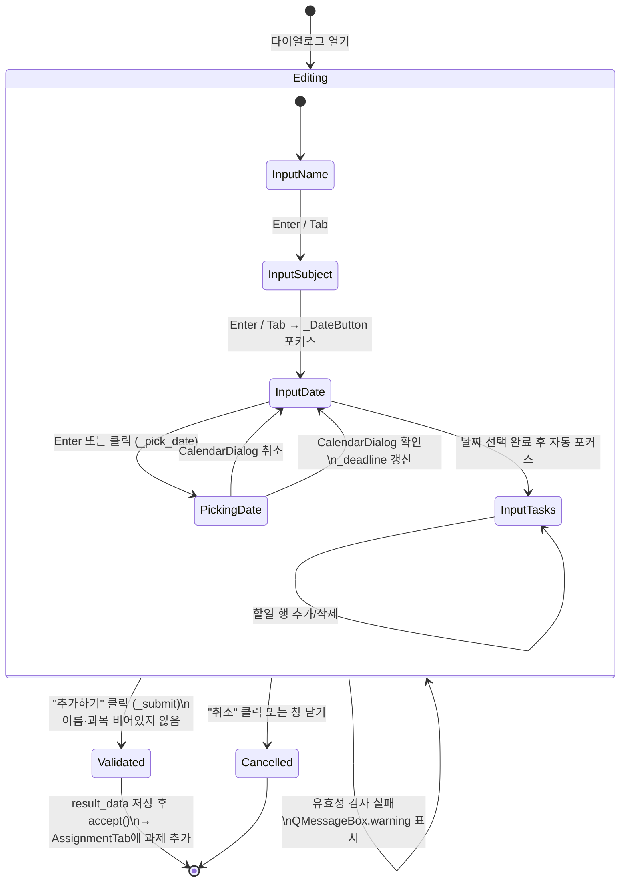
```mermaid
stateDiagram-v2
    [*] --> Editing : 다이얼로그 열기

    state Editing {
        [*] --> InputName
        InputName --> InputSubject  : Enter / Tab
        InputSubject --> InputDate  : Enter / Tab → _DateButton 포커스
        InputDate --> PickingDate   : Enter 또는 클릭 (_pick_date)
        PickingDate --> InputDate   : CalendarDialog 취소
        PickingDate --> InputDate   : CalendarDialog 확인\n_deadline 갱신
        InputDate --> InputTasks    : 날짜 선택 완료 후 자동 포커스
        InputTasks --> InputTasks   : 할일 행 추가/삭제
    }

    Editing --> Validated : "추가하기" 클릭 (_submit)\n이름·과목 비어있지 않음
    Editing --> Cancelled : "취소" 클릭 또는 창 닫기
    Editing --> Editing   : 유효성 검사 실패\nQMessageBox.warning 표시

    Validated --> [*] : result_data 저장 후 accept()\n→ AssignmentTab에 과제 추가
    Cancelled --> [*]
```

---

### 8. AddExamDialog — 시험 추가 다이얼로그

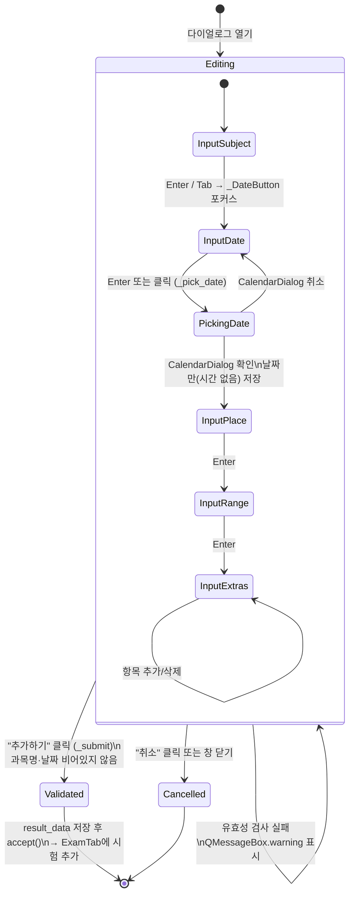
```mermaid
stateDiagram-v2
    [*] --> Editing : 다이얼로그 열기

    state Editing {
        [*] --> InputSubject
        InputSubject --> InputDate  : Enter / Tab → _DateButton 포커스
        InputDate --> PickingDate   : Enter 또는 클릭 (_pick_date)
        PickingDate --> InputDate   : CalendarDialog 취소
        PickingDate --> InputPlace  : CalendarDialog 확인\n날짜만(시간 없음) 저장
        InputPlace --> InputRange   : Enter
        InputRange --> InputExtras  : Enter
        InputExtras --> InputExtras : 항목 추가/삭제
    }

    Editing --> Validated : "추가하기" 클릭 (_submit)\n과목명·날짜 비어있지 않음
    Editing --> Cancelled : "취소" 클릭 또는 창 닫기
    Editing --> Editing   : 유효성 검사 실패\nQMessageBox.warning 표시

    Validated --> [*] : result_data 저장 후 accept()\n→ ExamTab에 시험 추가
    Cancelled --> [*]
```

---

### 9. MiniWidget — 타이머

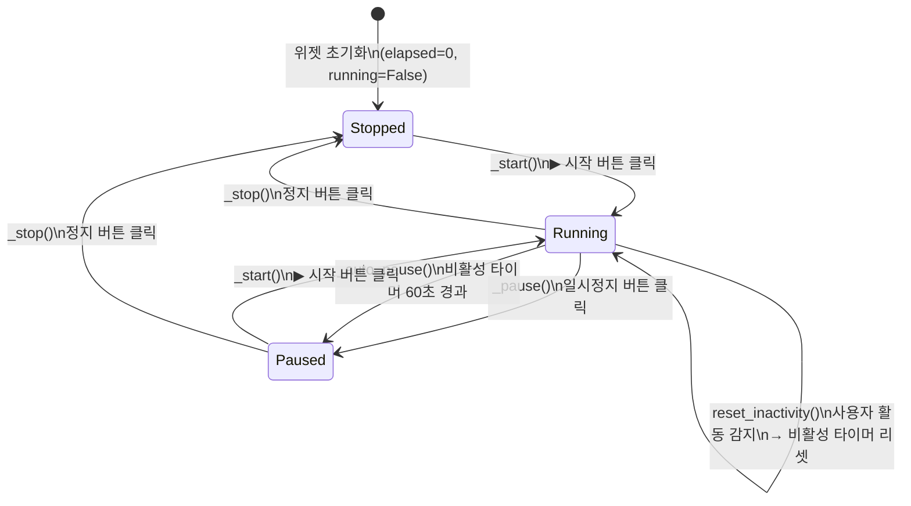
```mermaid
stateDiagram-v2
    [*] --> Stopped : 위젯 초기화\n(elapsed=0, running=False)

    Stopped --> Running  : _start()\n▶ 시작 버튼 클릭

    Running --> Paused   : _pause()\n일시정지 버튼 클릭
    Running --> Paused   : _auto_pause()\n비활성 타이머 60초 경과
    Running --> Stopped  : _stop()\n정지 버튼 클릭

    Paused  --> Running  : _start()\n▶ 시작 버튼 클릭
    Paused  --> Stopped  : _stop()\n정지 버튼 클릭

    Running --> Running  : _tick() 매 1초\n경과 시간 += 1\nHH:MM:SS 갱신

    Running --> Running  : reset_inactivity()\n사용자 활동 감지\n→ 비활성 타이머 리셋
```

---

### 10. MiniWidget — 위젯 표시 / 드래그 / 팝업

```mermaid
stateDiagram-v2
    [*] --> Visible : always_on_top = true\n또는 TrayIcon 토글

    state Visible {
        [*] --> AssignmentView

        AssignmentView --> ExamView       : 시험 탭 버튼 클릭\n_switch_tab("exam")
        ExamView --> AssignmentView       : 과제 탭 버튼 클릭\n_switch_tab("assignment")

        AssignmentView --> AssignmentView : _refresh_list()\n데이터 변경 시 목록 갱신
        ExamView       --> ExamView       : _refresh_list()

        AssignmentView --> PopupOpen      : 항목 행 클릭\n_show_popup()
        ExamView       --> PopupOpen      : 항목 행 클릭\n_show_popup()
        PopupOpen --> PopupOpen           : 체크박스 토글\n→ data_changed emit
        PopupOpen --> AssignmentView      : ChecklistPopup "x" 클릭 / 다른 행 클릭
        PopupOpen --> ExamView            : ChecklistPopup "x" 클릭 / 다른 행 클릭

        AssignmentView --> Dragging       : 잠금 해제 상태에서\nmousePressEvent (Left)
        ExamView       --> Dragging       : 잠금 해제 상태에서\nmousePressEvent (Left)
        Dragging --> Dragging             : mouseMoveEvent → 위치 이동
        Dragging --> AssignmentView       : mouseReleaseEvent\n위치 저장 (widget_pos)
        Dragging --> ExamView             : mouseReleaseEvent\n위치 저장 (widget_pos)
    }

    Visible --> Hidden : always_on_top OFF\nMainWindow._toggle_top(False)
    Hidden  --> Visible : always_on_top ON\nMainWindow._toggle_top(True)
```

---

### 11. TrashTab — 휴지통

```mermaid
stateDiagram-v2
    [*] --> Empty : deleted 목록이 비어있음

    Empty --> HasItems : 과제 또는 시험 삭제\n→ deleted 목록에 추가

    HasItems --> HasItems        : _del_one(iid)\n단일 항목 영구 삭제

    HasItems --> ConfirmingClear : _clear_all()\n"전체 삭제" 버튼 클릭
    ConfirmingClear --> Empty    : ConfirmDialog "전체 삭제" 승인
    ConfirmingClear --> HasItems : ConfirmDialog 취소

    HasItems --> Empty           : 마지막 항목 _del_one() 후\ndeleted 목록이 빈 경우
```

---

## 6. Glossary
- StudyMate: 과제 진행도와 시험 준비 상태를 통합 관리하는 본 소프트웨어의 명칭이다.
- Assignment (과제): 마감 기한과 세부 할 일(Task) 목록을 가진 학습 단위이다.
- Exam (시험): 과목, 날짜, 장소, 범위 및 체크리스트를 포함하는 학습 단위이다.
- Task (할 일): 과제를 구성하는 최소 단위의 행동 항목이며, 완료 여부에 따라 과제의 진행률을 결정한다.
- Mini-Widget (미니 위젯): 메인 창과 별개로 항상 최상단(Always on Top)에 위치하여 핵심 정보를 요약 제공하는 보조 UI이다.
- Progress Bar (진행도 바): 과제의 전체 Task 중 완료된 Task의 비율을 시각적으로 나타낸 요소이다.
- D-Day: 시험 날짜와 현재 날짜를 비교하여 남은 기간을 나타내는 지표이다.
- Theme (테마): UI의 배경색, 카드색, 강조색(Primary), 텍스트색 등을 정의한 색상 집합이다.
- Rebuild / Refresh: 데이터의 변경 사항을 UI에 즉각 반영하기 위해 위젯을 삭제하고 다시 그리는 프로세스이다.
- Trash (휴지통): 사용자가 삭제한 과제나 시험 항목이 임시로 보관되는 영역이다.
- Subject (과목): 과제나 시험이 속한 학문적 분류이며, 고유 색상을 부여하는 기준으로 사용된다.
